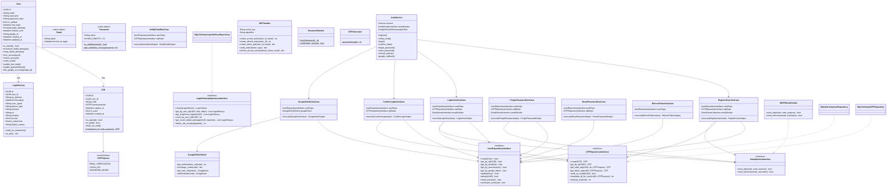

# Auth Service — Class Diagram

```mermaid
classDiagram
    direction TB

    %% ─── Domain Entities ───
    class User {
        +UUID id
        +String email
        +String username
        +String password_hash
        +bool is_verified
        +datetime last_login
        +int failed_login_attempts
        +datetime lockout_until
        +String google_id
        +datetime created_at
        +datetime updated_at
        +is_locked() bool
        +increment_failed_attempts()
        +reset_failed_attempts()
        +lock_account(until)
        +unlock_account()
        +verify_email()
        +update_last_login()
        +update_password(hash)
        +link_google_account(google_id)
    }

    class OTP {
        +UUID id
        +UUID user_id
        +String code
        +OTPPurpose purpose
        +datetime expires_at
        +bool is_used
        +datetime created_at
        +is_expired() bool
        +is_valid() bool
        +mark_as_used()
        +create(user_id, code, purpose)$ OTP
    }

    class LoginHistory {
        +UUID id
        +UUID user_id
        +String ip_address
        +datetime timestamp
        +String user_agent
        +String device_type
        +String browser
        +String os
        +String location
        +bool success
        +bool is_suspicious
        +String failure_reason
        +mark_as_suspicious()
        +to_dict() dict
    }

    class OTPPurpose {
        <<enumeration>>
        EMAIL_VERIFICATION
        LOGIN_2FA
        PASSWORD_RESET
    }

    %% ─── Value Objects ───
    class Email {
        <<value object>>
        +String value
        +validates format via regex
    }

    class Password {
        <<value object>>
        +String value
        +int MIN_LENGTH = 12
        +is_valid(password)$ bool
        +get_validation_errors(password)$ list
    }

    %% ─── Repository Interfaces ───
    class UserRepositoryInterface {
        <<interface>>
        +create(User) User
        +get_by_id(UUID) User
        +get_by_email(str) User
        +get_by_username(str) User
        +get_by_google_id(str) User
        +update(User) User
        +delete(UUID) bool
        +email_exists(str) bool
        +username_exists(str) bool
    }

    class OTPRepositoryInterface {
        <<interface>>
        +create(OTP) OTP
        +get_by_id(UUID) OTP
        +get_valid_otp(UUID, str, OTPPurpose) OTP
        +get_latest_otp(UUID, OTPPurpose) OTP
        +mark_as_used(UUID) bool
        +invalidate_all_for_user(UUID, OTPPurpose) int
        +cleanup_expired() int
    }

    class LoginHistoryRepositoryInterface {
        <<interface>>
        +create(LoginHistory) LoginHistory
        +get_by_user_id(UUID, limit, offset) List~LoginHistory~
        +get_suspicious_logins(UUID) List~LoginHistory~
        +count_by_user_id(UUID) int
        +get_recent_failed_attempts(UUID, datetime) List~LoginHistory~
        +delete_old_records(datetime) int
    }

    %% ─── Use Cases ───
    class RegisterUserUseCase {
        -UserRepositoryInterface userRepo
        -OTPRepositoryInterface otpRepo
        -EmailSenderInterface emailSender
        +execute(RegisterUserInput) RegisterUserOutput
    }

    class VerifyEmailUseCase {
        -UserRepositoryInterface userRepo
        -OTPRepositoryInterface otpRepo
        +execute(VerifyEmailInput) VerifyEmailOutput
    }

    class LoginUserUseCase {
        -UserRepositoryInterface userRepo
        -OTPRepositoryInterface otpRepo
        -EmailSenderInterface emailSender
        +execute(LoginUserInput) LoginUserOutput
    }

    class ConfirmLoginUseCase {
        -UserRepositoryInterface userRepo
        -OTPRepositoryInterface otpRepo
        +execute(ConfirmLoginInput) ConfirmLoginOutput
    }

    class ForgotPasswordUseCase {
        -UserRepositoryInterface userRepo
        -OTPRepositoryInterface otpRepo
        -EmailSenderInterface emailSender
        +execute(ForgotPasswordInput) ForgotPasswordOutput
    }

    class ResetPasswordUseCase {
        -UserRepositoryInterface userRepo
        -OTPRepositoryInterface otpRepo
        +execute(ResetPasswordInput) ResetPasswordOutput
    }

    class RefreshTokenUseCase {
        -UserRepositoryInterface userRepo
        +execute(RefreshTokenInput) RefreshTokenOutput
    }

    class GoogleOAuthUseCase {
        -UserRepositoryInterface userRepo
        -GoogleOAuthClient googleClient
        +execute(GoogleAuthInput) GoogleAuthOutput
    }

    %% ─── Application Service ───
    class AuthService {
        -Session session
        -EmailSenderInterface emailSender
        -GoogleOAuthClient googleClient
        +register()
        +verify_email()
        +login()
        +confirm_login()
        +forgot_password()
        +reset_password()
        +refresh_tokens()
        +google_callback()
    }

    %% ─── Infrastructure ───
    class JWTHandler {
        -String secret_key
        -String algorithm
        +create_access_token(user_id, email) str
        +create_refresh_token(user_id) str
        +create_token_pair(user_id, email) dict
        +verify_token(token, type) dict
        +refresh_access_token(refresh_token, email) dict
    }

    class PasswordHasher {
        +hash(password)$ str
        +verify(plain, hashed)$ bool
    }

    class OTPGenerator {
        +generate(length)$ str
    }

    class EmailSenderInterface {
        <<interface>>
        +send_otp(email, code, purpose) bool
        +send_welcome(email, username) bool
    }

    class SMTPEmailSender {
        +send_otp(email, code, purpose) bool
        +send_welcome(email, username) bool
    }

    class GoogleOAuthClient {
        +get_authorization_url(state) str
        +exchange_code(code) dict
        +get_user_info(token) GoogleUser
        +authenticate(code) GoogleUser
    }

    class SQLAlchemyUserRepository
    class SQLAlchemyOTPRepository
    class SQLAlchemyLoginHistoryRepository

    %% ─── Relationships ───
    OTP --> OTPPurpose
    User "1" --> "*" OTP : has
    User "1" --> "*" LoginHistory : has

    SQLAlchemyUserRepository ..|> UserRepositoryInterface
    SQLAlchemyOTPRepository ..|> OTPRepositoryInterface
    SQLAlchemyLoginHistoryRepository ..|> LoginHistoryRepositoryInterface
    SMTPEmailSender ..|> EmailSenderInterface

    RegisterUserUseCase --> UserRepositoryInterface
    RegisterUserUseCase --> OTPRepositoryInterface
    RegisterUserUseCase --> EmailSenderInterface
    LoginUserUseCase --> UserRepositoryInterface
    LoginUserUseCase --> OTPRepositoryInterface
    LoginUserUseCase --> EmailSenderInterface
    ConfirmLoginUseCase --> UserRepositoryInterface
    ConfirmLoginUseCase --> OTPRepositoryInterface
    ForgotPasswordUseCase --> UserRepositoryInterface
    ForgotPasswordUseCase --> EmailSenderInterface
    ResetPasswordUseCase --> UserRepositoryInterface
    RefreshTokenUseCase --> UserRepositoryInterface
    GoogleOAuthUseCase --> UserRepositoryInterface
    GoogleOAuthUseCase --> GoogleOAuthClient

    AuthService --> RegisterUserUseCase
    AuthService --> LoginUserUseCase
    AuthService --> ConfirmLoginUseCase
    AuthService --> GoogleOAuthUseCase
```
