# Diagramme de Classes – Module d'Authentification & Gestion des Utilisateurs

> **Figure X.X** – Class Diagram – Authentication & User Management Module

```mermaid
---
title: Class Diagram – Authentication & User Management
---
classDiagram

    %% ══════════════════════════════════════════════
    %%               DOMAIN LAYER
    %% ══════════════════════════════════════════════

    namespace Domain {

        class User {
            -id : UUID
            -email : String
            -username : String
            -password_hash : String
            -is_verified : bool
            -failed_login_attempts : int
            -lockout_until : DateTime
            -google_id : String
            -created_at : DateTime
            +is_locked() bool
            +verify_email() void
            +increment_failed_attempts() void
            +lock_account(until : DateTime) void
            +reset_failed_attempts() void
            +update_password(hash : String) void
            +update_last_login() void
        }

        class OTP {
            -id : UUID
            -user_id : UUID
            -code : String
            -purpose : OTPPurpose
            -expires_at : DateTime
            -is_used : bool
            +is_expired() bool
            +is_valid() bool
            +mark_as_used() void
            +create(userId, code, purpose, minutes)$ OTP
        }

        class OTPPurpose {
            <<enumeration>>
            EMAIL_VERIFICATION
            LOGIN_2FA
            PASSWORD_RESET
        }

        class LoginHistory {
            -id : UUID
            -user_id : UUID
            -ip_address : String
            -device_type : String
            -browser : String
            -success : bool
            -is_suspicious : bool
            -failure_reason : String
            +mark_as_suspicious() void
            +to_dict() dict
        }

        class Email {
            <<value object>>
            -value : String
            -_is_valid_email(email : String)$ bool
        }

        class Password {
            <<value object>>
            -value : String
            +is_valid(password : String)$ bool
            +get_validation_errors(pwd : String)$ List
        }

        class UserRepositoryInterface {
            <<interface>>
            +create(user : User)* User
            +get_by_id(id : UUID)* User
            +get_by_email(email : String)* User
            +update(user : User)* User
            +email_exists(email : String)* bool
            +username_exists(name : String)* bool
        }

        class OTPRepositoryInterface {
            <<interface>>
            +create(otp : OTP)* OTP
            +get_valid_otp(userId, code, purpose)* OTP
            +mark_as_used(id : UUID)* void
            +invalidate_all_for_user(userId, purpose)* void
        }

    }

    %% ══════════════════════════════════════════════
    %%            APPLICATION LAYER
    %% ══════════════════════════════════════════════

    namespace Application {

        class AuthService {
            -_user_repo : UserRepositoryInterface
            -_otp_repo : OTPRepositoryInterface
            -_email_sender : EmailSenderInterface
            -_jwt_handler : JWTHandler
            +register(email, username, pwd) dict
            +login(email, password) dict
            +confirm_login(email, otp) dict
            +verify_email(email, otp) dict
            +forgot_password(email) dict
            +reset_password(email, otp, pwd) dict
            +google_callback(code, state) dict
            +refresh_tokens(token) dict
        }

    }

    %% ══════════════════════════════════════════════
    %%           INFRASTRUCTURE LAYER
    %% ══════════════════════════════════════════════

    namespace Infrastructure {

        class SQLAlchemyUserRepository {
            -_session : Session
            +create(user : User) User
            +get_by_id(id : UUID) User
            +get_by_email(email : String) User
            +update(user : User) User
            +email_exists(email : String) bool
        }

        class SQLAlchemyOTPRepository {
            -_session : Session
            +create(otp : OTP) OTP
            +get_valid_otp(userId, code, purpose) OTP
            +mark_as_used(id : UUID) void
            +invalidate_all_for_user(userId, purpose) void
        }

        class JWTHandler {
            -secret_key : String
            -algorithm : String
            -access_expire_minutes : int
            +create_access_token(userId, email) String
            +create_refresh_token(userId) String
            +verify_token(token, type) dict
            +create_token_pair(userId, email) dict
        }

        class PasswordHasher {
            +hash(password : String)$ String
            +verify(plain, hashed)$ bool
        }

        class OTPGenerator {
            +generate(length : int)$ String
        }

        class EmailSenderInterface {
            <<interface>>
            +send_otp(to, code, purpose)* bool
            +send_welcome(to, username)* bool
        }

        class SMTPEmailSender {
            -smtp_host : String
            -smtp_port : int
            +send_otp(to, code, purpose) bool
            +send_welcome(to, username) bool
        }

        class GoogleOAuthClient {
            -client_id : String
            -client_secret : String
            +get_authorization_url(state) String
            +authenticate_sync(code) GoogleUser
        }

    }

    %% ══════════════════════════════════════════════
    %%              RELATIONSHIPS
    %% ══════════════════════════════════════════════

    %% Composition – User owns OTPs and LoginHistory
    User "1" *-- "0..*" OTP : generates
    User "1" *-- "0..*" LoginHistory : has

    %% Association – OTP uses OTPPurpose enum
    OTP --> OTPPurpose : has purpose

    %% Dependency – Value objects used for validation
    User ..> Email : validated by
    User ..> Password : validated by

    %% Realization – Repository Pattern (Dependency Inversion)
    UserRepositoryInterface <|.. SQLAlchemyUserRepository
    OTPRepositoryInterface <|.. SQLAlchemyOTPRepository
    EmailSenderInterface <|.. SMTPEmailSender

    %% Application layer depends on abstractions (DIP)
    AuthService --> UserRepositoryInterface
    AuthService --> OTPRepositoryInterface
    AuthService --> EmailSenderInterface
    AuthService --> JWTHandler
    AuthService --> GoogleOAuthClient
    AuthService ..> PasswordHasher : uses
    AuthService ..> OTPGenerator : uses
```

## Legend

| Symbol | Meaning |
|--------|---------|
| `──▶` | Association |
| `──◆` | Composition |
| `╌╌▷` | Realization (implements) |
| `╌╌▶` | Dependency |
| `- attribute` | Private |
| `+ method()` | Public |
| `*` | Abstract method |
| `$` | Static method |

## Architecture Notes

- **Domain Layer** – Core business entities, value objects, and repository interfaces (no dependencies on infrastructure)
- **Application Layer** – `AuthService` orchestrates use cases, depends only on domain interfaces
- **Infrastructure Layer** – Concrete implementations: database repositories, JWT security, email sending, Google OAuth
- The **Repository Pattern** with interfaces in Domain and implementations in Infrastructure follows the **Dependency Inversion Principle (DIP)**
