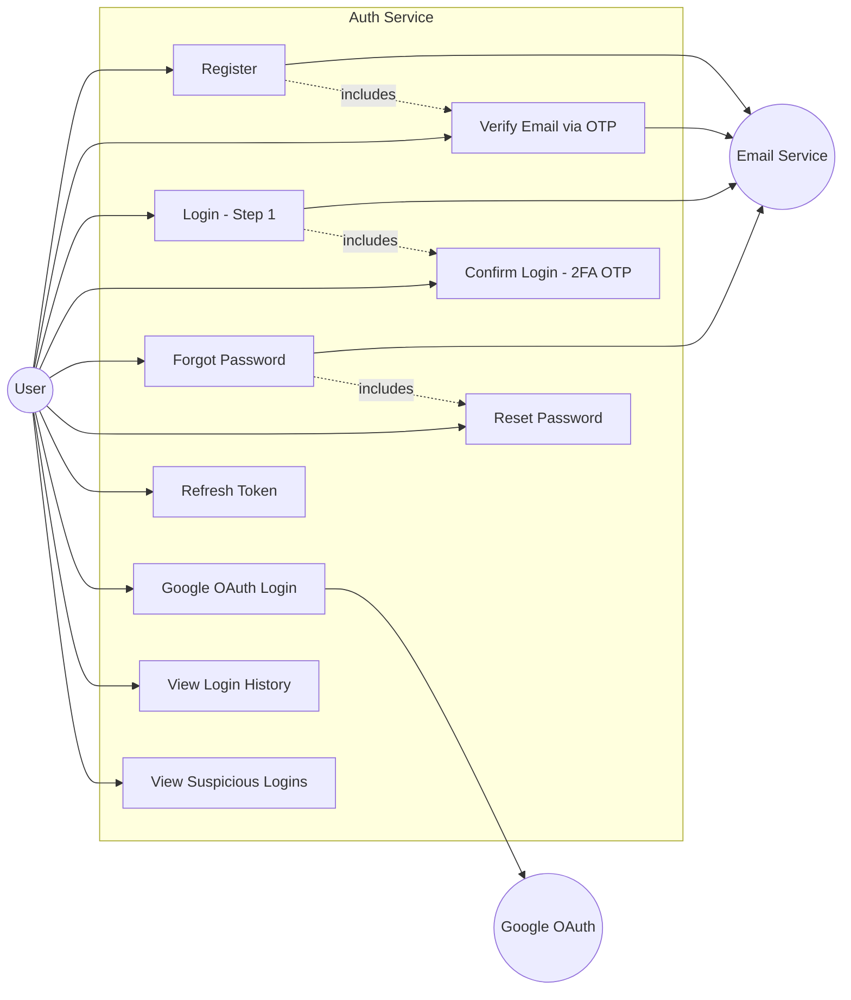

# Auth Service — Use Case Diagram

```mermaid
graph LR
    %% Actors
    User((User))
    Google((Google OAuth))
    EmailService((Email Service))

    %% Use Cases
    subgraph Auth Service
        UC1[Register]
        UC2[Verify Email via OTP]
        UC3[Login - Step 1]
        UC4[Confirm Login - 2FA OTP]
        UC5[Forgot Password]
        UC6[Reset Password]
        UC7[Refresh Token]
        UC8[Google OAuth Login]
        UC9[View Login History]
        UC10[View Suspicious Logins]
    end

    %% User relationships
    User --> UC1
    User --> UC2
    User --> UC3
    User --> UC4
    User --> UC5
    User --> UC6
    User --> UC7
    User --> UC8
    User --> UC9
    User --> UC10

    %% External system relationships
    UC1 --> EmailService
    UC2 --> EmailService
    UC3 --> EmailService
    UC5 --> EmailService
    UC8 --> Google

    %% Include/Extend
    UC1 -.->|includes| UC2
    UC3 -.->|includes| UC4
    UC5 -.->|includes| UC6
```
