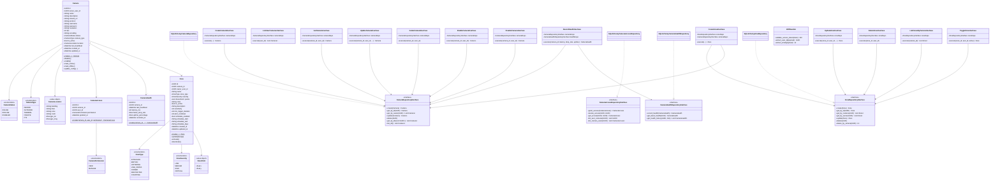

# Camera Management Service — Class Diagram

```mermaid
classDiagram
    direction TB

    %% ─── Domain Entities ───
    class Camera {
        +UUID id
        +UUID owner_user_id
        +String name
        +String description
        +String stream_url
        +String protocol
        +String username
        +String password
        +String resolution
        +int fps
        +String encoding
        +CameraStatus status
        +CameraType camera_type
        +bool is_active
        +CameraLocation location
        +datetime last_heartbeat
        +datetime created_at
        +datetime updated_at
        +create(...)$ Camera
        +disable()
        +enable()
        +mark_online()
        +mark_offline()
        +update_config(...)
    }

    class CameraStatus {
        <<enumeration>>
        ONLINE
        OFFLINE
        DISABLED
    }

    class CameraType {
        <<enumeration>>
        INDOOR
        OUTDOOR
        THERMAL
        FISHEYE
        PTZ
    }

    class CameraLocation {
        <<value object>>
        +String building
        +String floor
        +String zone
        +String room
        +float gps_lat
        +float gps_long
    }

    class CameraAccess {
        +UUID id
        +UUID camera_id
        +UUID user_id
        +CameraPermission permission
        +datetime granted_at
        +create(camera_id, user_id, permission)$ CameraAccess
    }

    class CameraPermission {
        <<enumeration>>
        VIEW
        MANAGE
    }

    class CameraHealth {
        +UUID id
        +UUID camera_id
        +datetime last_heartbeat
        +int latency_ms
        +float frame_drop_rate
        +float uptime_percentage
        +datetime recorded_at
        +create(camera_id, ...)$ CameraHealth
    }

    class Zone {
        +UUID id
        +UUID camera_id
        +UUID owner_user_id
        +String name
        +ZoneType zone_type
        +ZoneSeverity severity
        +List~ZonePoint~ points
        +String color
        +bool is_active
        +String description
        +int sensitivity
        +int min_trigger_duration
        +int alert_cooldown
        +bool schedule_enabled
        +String schedule_start
        +String schedule_end
        +String schedule_days
        +datetime created_at
        +datetime updated_at
        +create(...)$ Zone
        +update(kwargs)
        +activate()
        +deactivate()
    }

    class ZoneType {
        <<enumeration>>
        INTRUSION
        MOTION
        LOITERING
        LINE_CROSS
        CROWD
        RESTRICTED
        COUNTING
    }

    class ZoneSeverity {
        <<enumeration>>
        LOW
        MEDIUM
        HIGH
        CRITICAL
    }

    class ZonePoint {
        <<value object>>
        +float x
        +float y
    }

    %% ─── Repository Interfaces ───
    class CameraRepositoryInterface {
        <<interface>>
        +create(Camera) Camera
        +get_by_id(UUID) Camera
        +get_by_owner(UUID) List~Camera~
        +update(Camera) Camera
        +delete(UUID)
        +get_by_ids(List~UUID~) List~Camera~
        +list_all() List~Camera~
    }

    class CameraAccessRepositoryInterface {
        <<interface>>
        +grant_access(CameraAccess) CameraAccess
        +revoke_access(UUID, UUID)
        +get_access(UUID, UUID) CameraAccess
        +list_user_cameras(UUID) List~UUID~
        +list_camera_users(UUID) List~CameraAccess~
    }

    class CameraHealthRepositoryInterface {
        <<interface>>
        +record_health(CameraHealth) CameraHealth
        +get_latest_health(UUID) CameraHealth
        +get_health_history(UUID, limit) List~CameraHealth~
    }

    class ZoneRepositoryInterface {
        <<interface>>
        +create(Zone) Zone
        +get_by_id(UUID) Zone
        +get_by_camera(UUID) List~Zone~
        +get_by_owner(UUID) List~Zone~
        +update(Zone) Zone
        +delete(UUID)
        +delete_by_camera(UUID) int
    }

    %% ─── Use Cases ───
    class CreateCameraUseCase {
        -CameraRepositoryInterface cameraRepo
        +execute(...) Camera
    }

    class GetCameraUseCase {
        -CameraRepositoryInterface cameraRepo
        +execute(camera_id, user_id) Camera
    }

    class ListUserCamerasUseCase {
        -CameraRepositoryInterface cameraRepo
        +execute(user_id) List~Camera~
    }

    class UpdateCameraUseCase {
        -CameraRepositoryInterface cameraRepo
        +execute(camera_id, user_id, ...) Camera
    }

    class DeleteCameraUseCase {
        -CameraRepositoryInterface cameraRepo
        +execute(camera_id, user_id)
    }

    class EnableCameraUseCase {
        -CameraRepositoryInterface cameraRepo
        +execute(camera_id, user_id) Camera
    }

    class DisableCameraUseCase {
        -CameraRepositoryInterface cameraRepo
        +execute(camera_id, user_id) Camera
    }

    class RecordHealthUseCase {
        -CameraRepositoryInterface cameraRepo
        -CameraHealthRepositoryInterface healthRepo
        +execute(camera_id, latency, drop_rate, uptime) CameraHealth
    }

    class CreateZoneUseCase {
        -ZoneRepositoryInterface zoneRepo
        -CameraRepositoryInterface cameraRepo
        +execute(...) Zone
    }

    class UpdateZoneUseCase {
        -ZoneRepositoryInterface zoneRepo
        +execute(zone_id, user_id, ...) Zone
    }

    class DeleteZoneUseCase {
        -ZoneRepositoryInterface zoneRepo
        +execute(zone_id, user_id)
    }

    class ListZonesByCameraUseCase {
        -ZoneRepositoryInterface zoneRepo
        +execute(camera_id) List~Zone~
    }

    class ToggleZoneUseCase {
        -ZoneRepositoryInterface zoneRepo
        +execute(zone_id, user_id, active) Zone
    }

    %% ─── Infrastructure ───
    class JWTHandler {
        +validate_access_token(token) dict
        +extract_user_id(payload) UUID
        +extract_email(payload) str
    }

    class SQLAlchemyCameraRepository
    class SQLAlchemyCameraAccessRepository
    class SQLAlchemyCameraHealthRepository
    class SQLAlchemyZoneRepository

    %% ─── Relationships ───
    Camera --> CameraStatus
    Camera --> CameraType
    Camera --> CameraLocation
    Camera "1" --> "*" CameraAccess
    Camera "1" --> "*" CameraHealth
    Camera "1" --> "*" Zone
    CameraAccess --> CameraPermission
    Zone --> ZoneType
    Zone --> ZoneSeverity
    Zone "1" --> "*" ZonePoint

    SQLAlchemyCameraRepository ..|> CameraRepositoryInterface
    SQLAlchemyCameraAccessRepository ..|> CameraAccessRepositoryInterface
    SQLAlchemyCameraHealthRepository ..|> CameraHealthRepositoryInterface
    SQLAlchemyZoneRepository ..|> ZoneRepositoryInterface

    CreateCameraUseCase --> CameraRepositoryInterface
    GetCameraUseCase --> CameraRepositoryInterface
    UpdateCameraUseCase --> CameraRepositoryInterface
    DeleteCameraUseCase --> CameraRepositoryInterface
    EnableCameraUseCase --> CameraRepositoryInterface
    DisableCameraUseCase --> CameraRepositoryInterface
    RecordHealthUseCase --> CameraRepositoryInterface
    RecordHealthUseCase --> CameraHealthRepositoryInterface
    CreateZoneUseCase --> ZoneRepositoryInterface
    CreateZoneUseCase --> CameraRepositoryInterface
    UpdateZoneUseCase --> ZoneRepositoryInterface
    DeleteZoneUseCase --> ZoneRepositoryInterface
    ListZonesByCameraUseCase --> ZoneRepositoryInterface
    ToggleZoneUseCase --> ZoneRepositoryInterface
```
