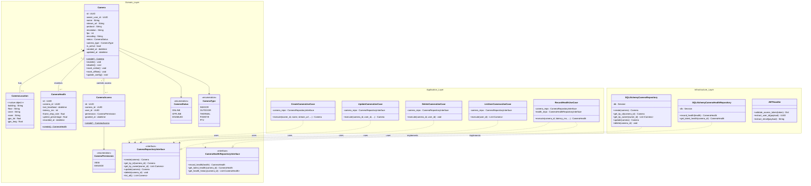

# Class Diagram – Camera Management Microservice

```mermaid
classDiagram
    direction TB

    namespace Domain_Layer {
        class Camera {
            -id : UUID
            -owner_user_id : UUID
            -name : String
            -stream_url : String
            -protocol : String
            -resolution : String
            -fps : int
            -encoding : String
            -status : CameraStatus
            -camera_type : CameraType
            -is_active : bool
            -created_at : datetime
            -updated_at : datetime
            +create()$ Camera
            +enable() void
            +disable() void
            +mark_online() void
            +mark_offline() void
            +update_config() void
        }

        class CameraLocation {
            &lt;&lt;value object&gt;&gt;
            -building : String
            -floor : String
            -zone : String
            -room : String
            -gps_lat : float
            -gps_long : float
        }

        class CameraHealth {
            -id : UUID
            -camera_id : UUID
            -last_heartbeat : datetime
            -latency_ms : int
            -frame_drop_rate : float
            -uptime_percentage : float
            -recorded_at : datetime
            +create()$ CameraHealth
        }

        class CameraAccess {
            -id : UUID
            -camera_id : UUID
            -user_id : UUID
            -permission : CameraPermission
            -granted_at : datetime
            +create()$ CameraAccess
        }

        class CameraStatus {
            <<enumeration>>
            ONLINE
            OFFLINE
            DISABLED
        }

        class CameraType {
            <<enumeration>>
            INDOOR
            OUTDOOR
            THERMAL
            FISHEYE
            PTZ
        }

        class CameraPermission {
            <<enumeration>>
            VIEW
            MANAGE
        }

        class CameraRepositoryInterface {
            <<interface>>
            +create(camera) Camera
            +get_by_id(camera_id) Camera
            +get_by_owner(owner_id) List~Camera~
            +update(camera) Camera
            +delete(camera_id) void
            +list_all() List~Camera~
        }

        class CameraHealthRepositoryInterface {
            <<interface>>
            +record_health(health) CameraHealth
            +get_latest_health(camera_id) CameraHealth
            +get_health_history(camera_id) List~CameraHealth~
        }
    }

    namespace Application_Layer {
        class CreateCameraUseCase {
            -camera_repo : CameraRepositoryInterface
            +execute(owner_id, name, stream_url, ...) Camera
        }

        class UpdateCameraUseCase {
            -camera_repo : CameraRepositoryInterface
            +execute(camera_id, user_id, ...) Camera
        }

        class DeleteCameraUseCase {
            -camera_repo : CameraRepositoryInterface
            +execute(camera_id, user_id) void
        }

        class ListUserCamerasUseCase {
            -camera_repo : CameraRepositoryInterface
            +execute(user_id) List~Camera~
        }

        class RecordHealthUseCase {
            -camera_repo : CameraRepositoryInterface
            -health_repo : CameraHealthRepositoryInterface
            +execute(camera_id, latency_ms, ...) CameraHealth
        }
    }

    namespace Infrastructure_Layer {
        class SQLAlchemyCameraRepository {
            -db : Session
            +create(camera) Camera
            +get_by_id(camera_id) Camera
            +get_by_owner(owner_id) List~Camera~
            +update(camera) Camera
            +delete(camera_id) void
        }

        class SQLAlchemyCameraHealthRepository {
            -db : Session
            +record_health(health) CameraHealth
            +get_latest_health(camera_id) CameraHealth
        }

        class JWTHandler {
            +validate_access_token(token) Dict
            +extract_user_id(payload) UUID
            +extract_email(payload) String
        }
    }

    %% ── Composition & Aggregation ──
    Camera "1" *-- "0..1" CameraLocation : has
    Camera "1" o-- "0..*" CameraHealth : monitors
    Camera "1" o-- "0..*" CameraAccess : controls access

    %% ── Enum Dependencies ──
    Camera --> CameraStatus
    Camera --> CameraType
    CameraAccess --> CameraPermission

    %% ── Dependency Inversion (implements) ──
    SQLAlchemyCameraRepository ..|> CameraRepositoryInterface : implements
    SQLAlchemyCameraHealthRepository ..|> CameraHealthRepositoryInterface : implements

    %% ── Use Cases depend on Domain Interfaces ──
    CreateCameraUseCase ..> CameraRepositoryInterface : uses
    UpdateCameraUseCase ..> CameraRepositoryInterface : uses
    DeleteCameraUseCase ..> CameraRepositoryInterface : uses
    ListUserCamerasUseCase ..> CameraRepositoryInterface : uses
    RecordHealthUseCase ..> CameraRepositoryInterface : uses
    RecordHealthUseCase ..> CameraHealthRepositoryInterface : uses
```
