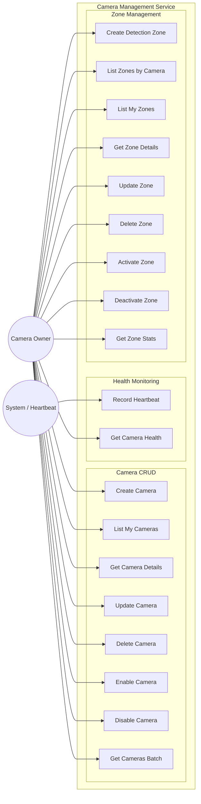

# Camera Management Service — Use Case Diagram

```mermaid
graph LR
    %% Actors
    Owner((Camera Owner))
    System((System / Heartbeat))

    %% Use Cases
    subgraph Camera Management Service
        direction TB
        subgraph Camera CRUD
            UC1[Create Camera]
            UC2[List My Cameras]
            UC3[Get Camera Details]
            UC4[Update Camera]
            UC5[Delete Camera]
            UC6[Enable Camera]
            UC7[Disable Camera]
            UC8[Get Cameras Batch]
        end
        subgraph Health Monitoring
            UC9[Record Heartbeat]
            UC10[Get Camera Health]
        end
        subgraph Zone Management
            UC11[Create Detection Zone]
            UC12[List Zones by Camera]
            UC13[List My Zones]
            UC14[Get Zone Details]
            UC15[Update Zone]
            UC16[Delete Zone]
            UC17[Activate Zone]
            UC18[Deactivate Zone]
            UC19[Get Zone Stats]
        end
    end

    %% Owner relationships
    Owner --> UC1
    Owner --> UC2
    Owner --> UC3
    Owner --> UC4
    Owner --> UC5
    Owner --> UC6
    Owner --> UC7
    Owner --> UC8
    Owner --> UC10
    Owner --> UC11
    Owner --> UC12
    Owner --> UC13
    Owner --> UC14
    Owner --> UC15
    Owner --> UC16
    Owner --> UC17
    Owner --> UC18
    Owner --> UC19

    %% System relationships
    System --> UC9
```
