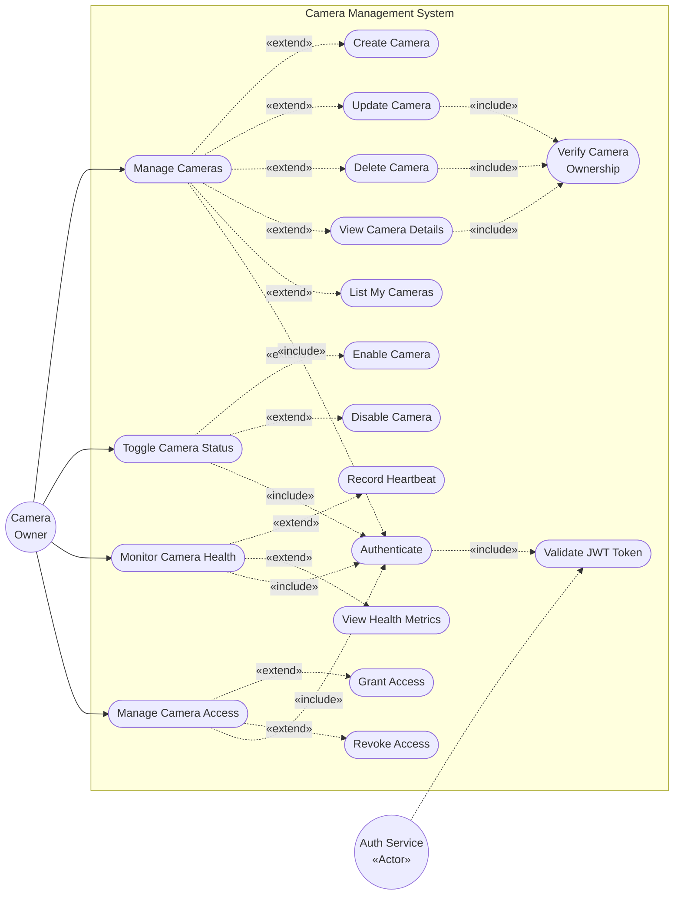

# Use Case Diagram – Camera Management Microservice

```mermaid
flowchart LR
    %% ── Actors ──
    Owner(("Camera\nOwner"))

    subgraph System["Camera Management System"]
        direction TB

        MC(["Manage Cameras"])
        CC(["Create Camera"])
        UC(["Update Camera"])
        DC(["Delete Camera"])
        VC(["View Camera Details"])
        LC(["List My Cameras"])

        TS(["Toggle Camera Status"])
        EN(["Enable Camera"])
        DIS(["Disable Camera"])

        MH(["Monitor Camera Health"])
        RH(["Record Heartbeat"])
        VH(["View Health Metrics"])

        MA(["Manage Camera Access"])
        GA(["Grant Access"])
        RA(["Revoke Access"])

        AUTH(["Authenticate"])
        JWT(["Validate JWT Token"])
        OWN(["Verify Camera\nOwnership"])

        %% ── «extend» relationships ──
        MC -.->|"«extend»"| CC
        MC -.->|"«extend»"| UC
        MC -.->|"«extend»"| DC
        MC -.->|"«extend»"| VC
        MC -.->|"«extend»"| LC

        TS -.->|"«extend»"| EN
        TS -.->|"«extend»"| DIS

        MH -.->|"«extend»"| RH
        MH -.->|"«extend»"| VH

        MA -.->|"«extend»"| GA
        MA -.->|"«extend»"| RA

        %% ── «include» relationships ──
        MC -.->|"«include»"| AUTH
        TS -.->|"«include»"| AUTH
        MH -.->|"«include»"| AUTH
        MA -.->|"«include»"| AUTH
        AUTH -.->|"«include»"| JWT

        DC -.->|"«include»"| OWN
        UC -.->|"«include»"| OWN
        VC -.->|"«include»"| OWN
    end

    %% ── External Actor ──
    AuthSvc(("Auth Service\n«Actor»"))

    %% ── Actor associations ──
    Owner --> MC
    Owner --> TS
    Owner --> MH
    Owner --> MA
    AuthSvc -.-> JWT
```
