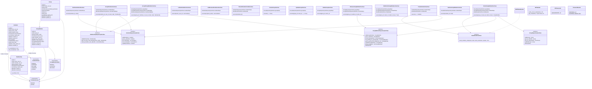

# Members Invitation Service — Class Diagram

```mermaid
classDiagram
    direction TB

    %% ─── Domain Entities ───
    class Invitation {
        +UUID id
        +UUID inviter_user_id
        +String inviter_email
        +String recipient_email
        +PermissionLevel permission
        +List~String~ camera_ids
        +datetime created_at
        +datetime expires_at
        +bool unlimited
        +InvitationStatus status
        +String code_hash
        +datetime code_expires_at
        +datetime handled_at
        +is_expired(now) bool
        +can_accept(now) bool
    }

    class InvitationStatus {
        <<enumeration>>
        PENDING
        ACCEPTED
        DECLINED
        CANCELED
        EXPIRED
    }

    class PermissionLevel {
        <<enumeration>>
        READER
        EDITOR
    }

    class Membership {
        +UUID id
        +UUID owner_user_id
        +UUID member_user_id
        +String member_email
        +PermissionLevel permission
        +List~String~ camera_ids
        +datetime created_at
        +datetime revoked_at
        +is_active() bool
    }

    class Group {
        +UUID id
        +UUID owner_user_id
        +String name
        +PermissionLevel default_permission
        +String description
        +String icon
        +String color
        +List~String~ camera_ids
        +datetime created_at
        +datetime updated_at
    }

    class GroupMember {
        +UUID id
        +UUID group_id
        +String member_email
        +PermissionLevel access
        +UUID member_user_id
        +String invite_code_hash
        +datetime code_expires_at
        +GroupMemberStatus status
        +datetime created_at
        +datetime handled_at
    }

    class GroupMemberStatus {
        <<enumeration>>
        PENDING
        ACCEPTED
        DECLINED
    }

    %% ─── Repository Interfaces ───
    class InvitationRepositoryInterface {
        <<interface>>
        +add(Invitation) Invitation
        +get_by_id(UUID) Invitation
        +list_sent(UUID) List~Invitation~
        +list_received(str) List~Invitation~
        +update(Invitation) Invitation
    }

    class MembershipRepositoryInterface {
        <<interface>>
        +add(Membership) Membership
        +get_by_owner_and_member(UUID, UUID) Membership
        +list_by_member_user_id(UUID) List~Membership~
    }

    class GroupRepositoryInterface {
        <<interface>>
        +add(Group) Group
        +get_by_id(UUID) Group
        +list_by_owner(UUID) List~Group~
        +update(Group) Group
        +delete(UUID)
    }

    class GroupMemberRepositoryInterface {
        <<interface>>
        +add(GroupMember) GroupMember
        +get_by_id(UUID) GroupMember
        +list_by_group(UUID) List~GroupMember~
        +list_pending_by_group(UUID) List~GroupMember~
        +get_by_group_and_email(UUID, str) GroupMember
        +update(GroupMember) GroupMember
        +list_by_email(str) List~GroupMember~
        +delete(UUID)
    }

    %% ─── Use Cases ───
    class CreateInvitationUseCase {
        -InvitationRepositoryInterface invitationRepo
        -EmailSenderInterface emailSender
        +execute(...) Invitation
    }

    class AcceptInvitationUseCase {
        -InvitationRepositoryInterface invitationRepo
        -MembershipRepositoryInterface membershipRepo
        +execute(invitation_id, user_id, email, code) Membership
    }

    class DeclineInvitationUseCase {
        -InvitationRepositoryInterface invitationRepo
        +execute(invitation_id, email)
    }

    class ListSentInvitationsUseCase {
        -InvitationRepositoryInterface invitationRepo
        +execute(inviter_user_id) List~Invitation~
    }

    class ListReceivedInvitationsUseCase {
        -InvitationRepositoryInterface invitationRepo
        +execute(recipient_email) List~Invitation~
    }

    class ResendInvitationCodeUseCase {
        -InvitationRepositoryInterface invitationRepo
        -EmailSenderInterface emailSender
        +execute(invitation_id)
    }

    class CreateGroupUseCase {
        -GroupRepositoryInterface groupRepo
        +execute(...) Group
    }

    class UpdateGroupUseCase {
        -GroupRepositoryInterface groupRepo
        +execute(group_id, owner_id, ...) Group
    }

    class DeleteGroupUseCase {
        -GroupRepositoryInterface groupRepo
        +execute(group_id, owner_id)
    }

    class InviteGroupMemberUseCase {
        -GroupRepositoryInterface groupRepo
        -GroupMemberRepositoryInterface memberRepo
        -EmailSenderInterface emailSender
        +execute(group_id, owner_id, email, access) GroupMember
    }

    class BulkInviteGroupMembersUseCase {
        -GroupRepositoryInterface groupRepo
        -GroupMemberRepositoryInterface memberRepo
        -EmailSenderInterface emailSender
        +execute(group_id, owner_id, emails, access) Tuple
    }

    class AcceptGroupMemberUseCase {
        -GroupRepositoryInterface groupRepo
        -GroupMemberRepositoryInterface memberRepo
        -MembershipRepositoryInterface membershipRepo
        +execute(group_id, member_id, user_id, email, code) Membership
    }

    class DeclineGroupMemberUseCase {
        -GroupMemberRepositoryInterface memberRepo
        +execute(member_id, email)
    }

    class RemoveGroupMemberUseCase {
        -GroupRepositoryInterface groupRepo
        -GroupMemberRepositoryInterface memberRepo
        +execute(group_id, member_id, owner_id)
    }

    %% ─── Infrastructure ───
    class EmailSenderInterface {
        <<interface>>
        +send_invitation_code(email, code, inviter, permission, expires) bool
    }

    class SMTPEmailSender
    class JWTHandler {
        +verify_access_token(token) dict
        +get_user(token) Tuple~UUID, str~
    }

    class OTPGenerator {
        +generate(length)$ str
    }

    class PasswordHasher {
        +hash(value)$ str
        +verify(plain, hashed)$ bool
    }

    %% ─── Relationships ───
    Invitation --> InvitationStatus
    Invitation --> PermissionLevel
    Membership --> PermissionLevel
    Group --> PermissionLevel
    GroupMember --> GroupMemberStatus
    GroupMember --> PermissionLevel
    Group "1" --> "*" GroupMember

    Invitation "1" ..> "0..1" Membership : creates on accept
    GroupMember "1" ..> "0..1" Membership : creates on accept

    SMTPEmailSender ..|> EmailSenderInterface

    CreateInvitationUseCase --> InvitationRepositoryInterface
    CreateInvitationUseCase --> EmailSenderInterface
    AcceptInvitationUseCase --> InvitationRepositoryInterface
    AcceptInvitationUseCase --> MembershipRepositoryInterface
    DeclineInvitationUseCase --> InvitationRepositoryInterface
    InviteGroupMemberUseCase --> GroupRepositoryInterface
    InviteGroupMemberUseCase --> GroupMemberRepositoryInterface
    InviteGroupMemberUseCase --> EmailSenderInterface
    AcceptGroupMemberUseCase --> GroupMemberRepositoryInterface
    AcceptGroupMemberUseCase --> MembershipRepositoryInterface
    RemoveGroupMemberUseCase --> GroupMemberRepositoryInterface
```
