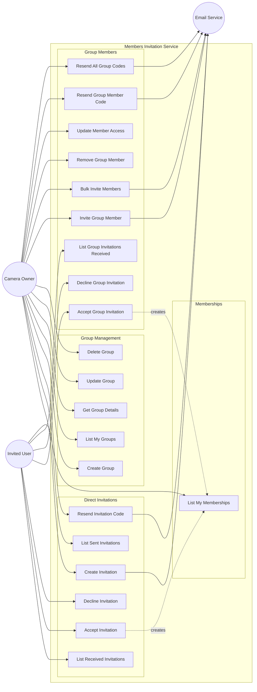

# Members Invitation Service — Use Case Diagram

```mermaid
graph LR
    %% Actors
    Inviter((Camera Owner))
    Recipient((Invited User))
    EmailSvc((Email Service))

    %% Use Cases
    subgraph Members Invitation Service
        direction TB
        subgraph Direct Invitations
            UC1[Create Invitation]
            UC2[List Sent Invitations]
            UC3[List Received Invitations]
            UC4[Accept Invitation]
            UC5[Decline Invitation]
            UC6[Resend Invitation Code]
        end
        subgraph Group Management
            UC7[Create Group]
            UC8[List My Groups]
            UC9[Get Group Details]
            UC10[Update Group]
            UC11[Delete Group]
        end
        subgraph Group Members
            UC12[Invite Group Member]
            UC13[Bulk Invite Members]
            UC14[Accept Group Invitation]
            UC15[Decline Group Invitation]
            UC16[Remove Group Member]
            UC17[Update Member Access]
            UC18[Resend Group Member Code]
            UC19[Resend All Group Codes]
            UC20[List Group Invitations Received]
        end
        subgraph Memberships
            UC21[List My Memberships]
        end
    end

    %% Inviter relationships
    Inviter --> UC1
    Inviter --> UC2
    Inviter --> UC6
    Inviter --> UC7
    Inviter --> UC8
    Inviter --> UC9
    Inviter --> UC10
    Inviter --> UC11
    Inviter --> UC12
    Inviter --> UC13
    Inviter --> UC16
    Inviter --> UC17
    Inviter --> UC18
    Inviter --> UC19

    %% Recipient relationships
    Recipient --> UC3
    Recipient --> UC4
    Recipient --> UC5
    Recipient --> UC14
    Recipient --> UC15
    Recipient --> UC20
    Recipient --> UC21

    %% Email Service
    UC1 --> EmailSvc
    UC6 --> EmailSvc
    UC12 --> EmailSvc
    UC13 --> EmailSvc
    UC18 --> EmailSvc
    UC19 --> EmailSvc

    %% Include relationships
    UC4 -.->|creates| UC21
    UC14 -.->|creates| UC21
```
