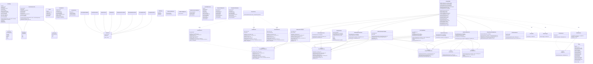

```mermaid
classDiagram
    direction TB

    %% ═══════════════════════════════════════════
    %% DOMAIN LAYER
    %% ═══════════════════════════════════════════

    class Recording {
        +string ID
        +string CameraID
        +string UserID
        +RecordingStatus Status
        +string FilePath
        +int64 FileSizeBytes
        +float64 DurationSeconds
        +StorageMode StorageMode
        +string ThumbnailPath
        +time.Time* StartedAt
        +time.Time* CompletedAt
        +time.Time CreatedAt
        +time.Time UpdatedAt
        +NewRecording(cameraID, userID, mode) Recording
        +Complete(filePath, size, duration)
        +MarkFailed()
        +MarkDeleted()
        +IsActive() bool
    }

    class CameraStorageConfig {
        +string CameraID
        +string UserID
        +StorageMode StorageMode
        +int RetentionDays
        +float64 QuotaGB
        +bool AutoRecord
        +SubscriptionTier SubscriptionTier
        +time.Time CreatedAt
        +time.Time UpdatedAt
        +NewCameraStorageConfig(cameraID, userID) CameraStorageConfig
        +CanUseCloudStorage() bool
        +Update(mode, retention, quota, auto)
    }

    class RecordingStatus {
        <<enumeration>>
        recording
        completed
        uploading
        failed
        deleted
    }

    class StorageMode {
        <<enumeration>>
        local
        minio
        azure
    }

    class SubscriptionTier {
        <<enumeration>>
        FREE
        PRO
    }

    class Camera {
        +string ID
        +string OwnerUserID
        +string Name
        +string StreamURL
        +bool IsEnabled
        +bool IsOnline
    }

    class StorageMetrics {
        +string CameraID
        +string UserID
        +int TotalRecordings
        +int ActiveRecordings
        +int64 TotalSizeBytes
        +float64 TotalDurationSeconds
        +float64 QuotaGB
        +float64 QuotaUsedPercent
        +StorageMode StorageMode
    }

    class DownloadToken {
        +string Token
        +string RecordingID
        +string DownloadURL
        +time.Time ExpiresAt
    }

    %% Domain Errors
    class DomainError {
        +string Message
        +string Code
        +Error() string
    }

    class RecordingNotFoundError
    class CameraNotFoundError
    class UnauthorizedError
    class ForbiddenError
    class StorageQuotaExceededError
    class SubscriptionRequiredError
    class RecordingActiveError
    class StorageBackendError

    %% Domain Interfaces
    class RecordingRepository {
        <<interface>>
        +GetByID(id) Recording, error
        +GetByCameraID(cameraID) []Recording, error
        +GetByUserID(userID) []Recording, error
        +GetActive() []Recording, error
        +GetActiveByCameraID(cameraID) Recording, error
        +Save(recording Recording) error
        +Update(recording Recording) error
        +Delete(id) error
    }

    class StorageConfigRepository {
        <<interface>>
        +GetByCameraID(cameraID) CameraStorageConfig, error
        +GetByUserID(userID) []CameraStorageConfig, error
        +Save(config CameraStorageConfig) error
        +Update(config CameraStorageConfig) error
    }

    class AuthService {
        <<interface>>
        +ValidateToken(token) AuthPayload, error
    }

    class CameraService {
        <<interface>>
        +GetCamera(cameraID, token) Camera, error
        +GetCamerasForUser(userID, token) []Camera, error
    }

    class StorageBackendInterface {
        <<interface>>
        +Upload(ctx, path, reader) error
        +Download(ctx, path) io.ReadCloser, error
        +Delete(ctx, path) error
        +GetSize(ctx, path) int64, error
        +Exists(ctx, path) bool, error
        +GetSignedURL(ctx, path, expiry) string, error
        +StreamRange(ctx, path, start, end) io.ReadCloser, int64, error
        +Mode() StorageMode
    }

    class RecordingService {
        <<interface>>
        +StartRecording(cameraID, streamURL, mode) Recording, error
        +StopRecording(cameraID) Recording, error
        +StopAll()
        +IsRecording(cameraID) bool
    }

    class AuthPayload {
        +string Sub
        +string Email
        +string Type
    }

    %% ═══════════════════════════════════════════
    %% APPLICATION LAYER
    %% ═══════════════════════════════════════════

    class StartRecordingUseCase {
        -RecordingRepository recordingRepo
        -StorageConfigRepository configRepo
        -CameraService cameraService
        -RecordingService recordingManager
        +Execute(userID, token, cameraID, storageMode) Recording, error
    }

    class StopRecordingUseCase {
        -RecordingRepository recordingRepo
        -RecordingService recordingManager
        +Execute(userID, cameraID) Recording, error
    }

    class ListRecordingsUseCase {
        -RecordingRepository recordingRepo
        +ByCamera(userID, cameraID) []Recording, error
        +ByUser(userID) []Recording, error
    }

    class GetStorageMetricsUseCase {
        -RecordingRepository recordingRepo
        -StorageConfigRepository configRepo
        +ForCamera(userID, cameraID) StorageMetrics, error
        +ForUser(userID) StorageMetrics, error
    }

    class ManageStorageConfigUseCase {
        -StorageConfigRepository configRepo
        +GetOrCreate(userID, cameraID) CameraStorageConfig, error
        +Update(userID, cameraID, input) CameraStorageConfig, error
        +ListByUser(userID) []CameraStorageConfig, error
        +UpdateSubscription(userID, cameraID, tier) error
    }

    %% DTOs
    class StartRecordingRequest {
        +string CameraID
        +string StorageMode
    }

    class StopRecordingRequest {
        +string CameraID
    }

    class UpdateStorageConfigRequest {
        +string StorageMode
        +int RetentionDays
        +float64 QuotaGB
        +bool AutoRecord
    }

    class RecordingResponse {
        +string ID
        +string CameraID
        +string UserID
        +string Status
        +string FilePath
        +int64 FileSizeBytes
        +float64 DurationSeconds
        +string StorageMode
        +string ThumbnailPath
        +string StartedAt
        +string CompletedAt
        +string CreatedAt
    }

    class StorageConfigResponse {
        +string CameraID
        +string UserID
        +string StorageMode
        +int RetentionDays
        +float64 QuotaGB
        +bool AutoRecord
        +string SubscriptionTier
        +string CreatedAt
        +string UpdatedAt
    }

    class StorageMetricsResponse {
        +string CameraID
        +string UserID
        +int TotalRecordings
        +int ActiveRecordings
        +int64 TotalSizeBytes
        +float64 TotalDurationSeconds
        +float64 QuotaGB
        +float64 QuotaUsedPercent
        +string StorageMode
    }

    %% ═══════════════════════════════════════════
    %% INFRASTRUCTURE LAYER
    %% ═══════════════════════════════════════════

    class Config {
        +int Port
        +string JWTSecret
        +string CameraServiceURL
        +string MediaMTXRTSPURL
        +string FFmpegPath
        +string StorageMode
        +string StorageBasePath
        +string MinIOEndpoint
        +string MinIOAccessKey
        +string MinIOSecretKey
        +string MinIOBucket
        +bool MinIOUseSSL
        +string AzureAccountName
        +string AzureAccountKey
        +string AzureContainerName
        +string DatabaseURL
        +Load() Config
    }

    class JWTAuthService {
        -string secret
        +ValidateToken(token) AuthPayload, error
    }

    class HTTPCameraService {
        -http.Client client
        -string baseURL
        +GetCamera(cameraID, token) Camera, error
        +GetCamerasForUser(userID, token) []Camera, error
    }

    class LocalFSBackend {
        -string basePath
        +Upload(ctx, path, reader) error
        +Download(ctx, path) io.ReadCloser, error
        +Delete(ctx, path) error
        +GetSize(ctx, path) int64, error
        +Exists(ctx, path) bool, error
        +GetSignedURL(ctx, path, expiry) string, error
        +StreamRange(ctx, path, start, end) io.ReadCloser, int64, error
        +Mode() StorageMode
    }

    class MinIOBackend {
        -minio.Client client
        -string bucket
        +Upload(ctx, path, reader) error
        +Download(ctx, path) io.ReadCloser, error
        +Delete(ctx, path) error
        +GetSize(ctx, path) int64, error
        +Exists(ctx, path) bool, error
        +GetSignedURL(ctx, path, expiry) string, error
        +StreamRange(ctx, path, start, end) io.ReadCloser, int64, error
        +Mode() StorageMode
    }

    class AzureBlobBackend {
        -azblob.Client client
        -string containerName
        +Upload(ctx, path, reader) error
        +Download(ctx, path) io.ReadCloser, error
        +Delete(ctx, path) error
        +GetSize(ctx, path) int64, error
        +Exists(ctx, path) bool, error
        +GetSignedURL(ctx, path, expiry) string, error
        +StreamRange(ctx, path, start, end) io.ReadCloser, int64, error
        +Mode() StorageMode
    }

    class StorageFactory {
        +NewStorageBackend(cfg Config) StorageBackendInterface
    }

    class RecordingManager {
        -sync.RWMutex mu
        -Config cfg
        -StorageBackendInterface storage
        -RecordingRepository recordingRepo
        -map~string,*exec.Cmd~ sessions
        +StartRecording(cameraID, streamURL, mode) Recording, error
        +StopRecording(cameraID) Recording, error
        +StopAll()
        +IsRecording(cameraID) bool
    }

    class RetentionCleaner {
        -cron.Cron scheduler
        -RecordingRepository recordingRepo
        -StorageConfigRepository configRepo
        -StorageBackendInterface storage
        +Start()
        +Stop()
        -cleanup()
        -enforceQuota(cameraID, quotaGB)
    }

    class InMemoryRecordingRepo {
        -sync.RWMutex mu
        -map recordings
        +GetByID(id) Recording, error
        +GetByCameraID(cameraID) []Recording, error
        +GetByUserID(userID) []Recording, error
        +GetActive() []Recording, error
        +GetActiveByCameraID(cameraID) Recording, error
        +Save(recording) error
        +Update(recording) error
        +Delete(id) error
    }

    class InMemoryStorageConfigRepo {
        -sync.RWMutex mu
        -map configs
        +GetByCameraID(cameraID) CameraStorageConfig, error
        +GetByUserID(userID) []CameraStorageConfig, error
        +Save(config) error
        +Update(config) error
    }

    %% ═══════════════════════════════════════════
    %% API LAYER
    %% ═══════════════════════════════════════════

    class StorageHandler {
        -StartRecordingUseCase startRecordingUC
        -StopRecordingUseCase stopRecordingUC
        -ListRecordingsUseCase listRecordingsUC
        -GetStorageMetricsUseCase getMetricsUC
        -ManageStorageConfigUseCase manageConfigUC
        -StorageBackendInterface storage
        -RecordingRepository recordingRepo
        +RegisterRoutes(rg, authService)
        +StartRecording(c Context)
        +StopRecording(c Context)
        +ListRecordingsByCamera(c Context)
        +ListRecordingsByUser(c Context)
        +GetActiveRecordings(c Context)
        +DeleteRecording(c Context)
        +DownloadRecording(c Context)
        +StreamRecording(c Context)
        +GetThumbnail(c Context)
        +GetCameraSettings(c Context)
        +UpdateCameraSettings(c Context)
        +ListUserSettings(c Context)
        +GetCameraMetrics(c Context)
        +GetUserMetrics(c Context)
        +GetDownloadToken(c Context)
        +UpdateSubscription(c Context)
    }

    class AuthMiddleware {
        +AuthMiddleware(authService) HandlerFunc
        +GetUser(c) AuthPayload
        +GetToken(c) string
    }

    class ErrorHandler {
        +ErrorHandler() HandlerFunc
    }

    class RequestLogger {
        +RequestLogger() HandlerFunc
    }

    %% ═══════════════════════════════════════════
    %% RELATIONSHIPS
    %% ═══════════════════════════════════════════

    Recording --> RecordingStatus
    Recording --> StorageMode
    CameraStorageConfig --> StorageMode
    CameraStorageConfig --> SubscriptionTier

    RecordingNotFoundError --|> DomainError
    CameraNotFoundError --|> DomainError
    UnauthorizedError --|> DomainError
    ForbiddenError --|> DomainError
    StorageQuotaExceededError --|> DomainError
    SubscriptionRequiredError --|> DomainError
    RecordingActiveError --|> DomainError
    StorageBackendError --|> DomainError

    JWTAuthService ..|> AuthService
    HTTPCameraService ..|> CameraService
    LocalFSBackend ..|> StorageBackendInterface
    MinIOBackend ..|> StorageBackendInterface
    AzureBlobBackend ..|> StorageBackendInterface
    RecordingManager ..|> RecordingService
    InMemoryRecordingRepo ..|> RecordingRepository
    InMemoryStorageConfigRepo ..|> StorageConfigRepository

    StorageFactory ..> LocalFSBackend : creates
    StorageFactory ..> MinIOBackend : creates
    StorageFactory ..> AzureBlobBackend : creates

    StartRecordingUseCase --> RecordingRepository
    StartRecordingUseCase --> StorageConfigRepository
    StartRecordingUseCase --> CameraService
    StartRecordingUseCase --> RecordingService
    StopRecordingUseCase --> RecordingRepository
    StopRecordingUseCase --> RecordingService
    ListRecordingsUseCase --> RecordingRepository
    GetStorageMetricsUseCase --> RecordingRepository
    GetStorageMetricsUseCase --> StorageConfigRepository
    ManageStorageConfigUseCase --> StorageConfigRepository

    RecordingManager --> Config
    RecordingManager --> StorageBackendInterface
    RecordingManager --> RecordingRepository

    RetentionCleaner --> RecordingRepository
    RetentionCleaner --> StorageConfigRepository
    RetentionCleaner --> StorageBackendInterface

    StorageHandler --> StartRecordingUseCase
    StorageHandler --> StopRecordingUseCase
    StorageHandler --> ListRecordingsUseCase
    StorageHandler --> GetStorageMetricsUseCase
    StorageHandler --> ManageStorageConfigUseCase
    StorageHandler --> StorageBackendInterface
    StorageHandler --> RecordingRepository

    AuthMiddleware --> AuthService

    StorageHandler ..> AuthMiddleware : uses
    StorageHandler ..> ErrorHandler : uses
    StorageHandler ..> RequestLogger : uses
```
