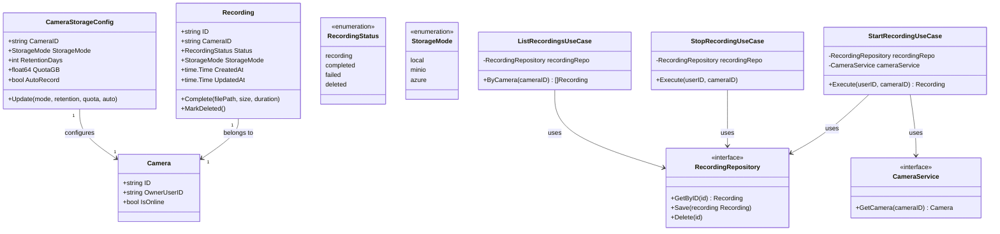

```mermaid
classDiagram
    direction TB

    %% Domain Layer
    class Recording {
        +string ID
        +string CameraID
        +RecordingStatus Status
        +StorageMode StorageMode
        +time.Time CreatedAt
        +time.Time UpdatedAt
        +Complete(filePath, size, duration)
        +MarkDeleted()
    }

    class CameraStorageConfig {
        +string CameraID
        +StorageMode StorageMode
        +int RetentionDays
        +float64 QuotaGB
        +bool AutoRecord
        +Update(mode, retention, quota, auto)
    }

    class RecordingStatus {
        <<enumeration>>
        recording
        completed
        failed
        deleted
    }

    class StorageMode {
        <<enumeration>>
        local
        minio
        azure
    }

    class Camera {
        +string ID
        +string OwnerUserID
        +bool IsOnline
    }

    %% Application Layer
    class StartRecordingUseCase {
        -RecordingRepository recordingRepo
        -CameraService cameraService
        +Execute(userID, cameraID) Recording
    }

    class StopRecordingUseCase {
        -RecordingRepository recordingRepo
        +Execute(userID, cameraID)
    }

    class ListRecordingsUseCase {
        -RecordingRepository recordingRepo
        +ByCamera(cameraID) []Recording
    }

    %% Infrastructure Layer
    class RecordingRepository {
        <<interface>>
        +GetByID(id) Recording
        +Save(recording Recording)
        +Delete(id)
    }

    class CameraService {
        <<interface>>
        +GetCamera(cameraID) Camera
    }

    %% Relationships
    Recording "1" --> "1" Camera : belongs to
    CameraStorageConfig "1" --> "1" Camera : configures
    StartRecordingUseCase --> RecordingRepository : uses
    StartRecordingUseCase --> CameraService : uses
    StopRecordingUseCase --> RecordingRepository : uses
    ListRecordingsUseCase --> RecordingRepository : uses
```
