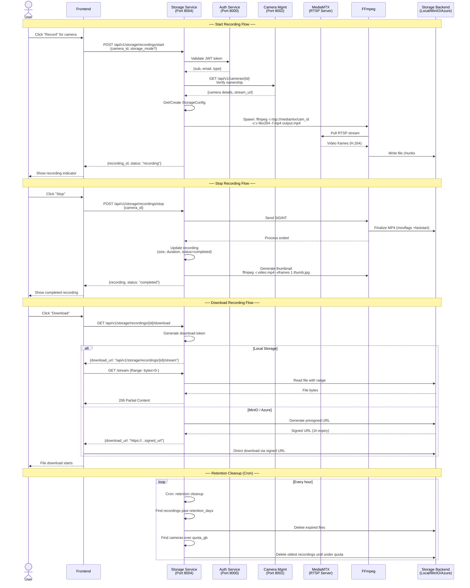

```mermaid
sequenceDiagram
    actor User
    participant Frontend
    participant StorageSvc as Storage Service<br/>(Port 8004)
    participant AuthSvc as Auth Service<br/>(Port 8000)
    participant CamMgmt as Camera Mgmt<br/>(Port 8002)
    participant MediaMTX as MediaMTX<br/>(RTSP Server)
    participant FFmpeg
    participant StorageBE as Storage Backend<br/>(Local/MinIO/Azure)

    Note over User, StorageBE: ── Start Recording Flow ──

    User->>Frontend: Click "Record" for camera
    Frontend->>StorageSvc: POST /api/v1/storage/recordings/start<br/>{camera_id, storage_mode?}
    StorageSvc->>AuthSvc: Validate JWT token
    AuthSvc-->>StorageSvc: {sub, email, type}
    StorageSvc->>CamMgmt: GET /api/v1/cameras/{id}<br/>Verify ownership
    CamMgmt-->>StorageSvc: {camera details, stream_url}
    StorageSvc->>StorageSvc: Get/Create StorageConfig
    StorageSvc->>FFmpeg: Spawn: ffmpeg -i rtsp://mediamtx/cam_id<br/>-c:v libx264 -f mp4 output.mp4
    FFmpeg->>MediaMTX: Pull RTSP stream
    MediaMTX-->>FFmpeg: Video frames (H.264)
    FFmpeg->>StorageBE: Write file chunks
    StorageSvc-->>Frontend: {recording_id, status: "recording"}
    Frontend-->>User: Show recording indicator

    Note over User, StorageBE: ── Stop Recording Flow ──

    User->>Frontend: Click "Stop"
    Frontend->>StorageSvc: POST /api/v1/storage/recordings/stop<br/>{camera_id}
    StorageSvc->>FFmpeg: Send SIGINT
    FFmpeg->>StorageBE: Finalize MP4 (movflags +faststart)
    FFmpeg-->>StorageSvc: Process exited
    StorageSvc->>StorageSvc: Update recording<br/>(size, duration, status=completed)
    StorageSvc->>FFmpeg: Generate thumbnail<br/>ffmpeg -i video.mp4 -vframes 1 thumb.jpg
    StorageSvc-->>Frontend: {recording, status: "completed"}
    Frontend-->>User: Show completed recording

    Note over User, StorageBE: ── Download Recording Flow ──

    User->>Frontend: Click "Download"
    Frontend->>StorageSvc: GET /api/v1/storage/recordings/{id}/download
    StorageSvc->>StorageSvc: Generate download token
    alt Local Storage
        StorageSvc-->>Frontend: {download_url: "/api/v1/storage/recordings/{id}/stream"}
        Frontend->>StorageSvc: GET /stream (Range: bytes=0-)
        StorageSvc->>StorageBE: Read file with range
        StorageBE-->>StorageSvc: File bytes
        StorageSvc-->>Frontend: 206 Partial Content
    else MinIO / Azure
        StorageSvc->>StorageBE: Generate presigned URL
        StorageBE-->>StorageSvc: Signed URL (1h expiry)
        StorageSvc-->>Frontend: {download_url: "https://...signed_url"}
        Frontend->>StorageBE: Direct download via signed URL
    end
    Frontend-->>User: File download starts

    Note over User, StorageBE: ── Retention Cleanup (Cron) ──

    loop Every hour
        StorageSvc->>StorageSvc: Cron: retention cleanup
        StorageSvc->>StorageSvc: Find recordings past retention_days
        StorageSvc->>StorageBE: Delete expired files
        StorageSvc->>StorageSvc: Find cameras over quota_gb
        StorageSvc->>StorageBE: Delete oldest recordings until under quota
    end
```
