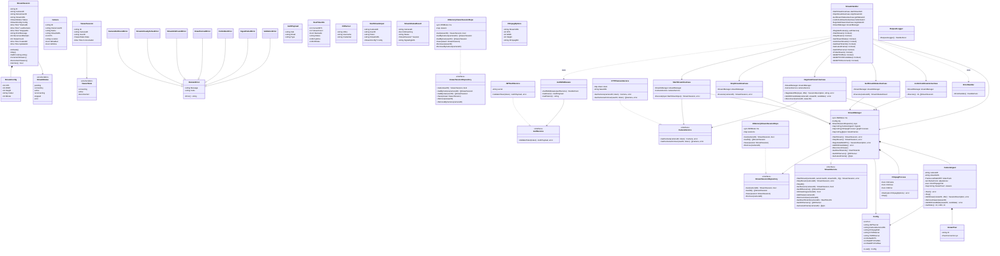

```mermaid
classDiagram
    direction TB

    %% ═══════════════════════════════════════════
    %% DOMAIN LAYER
    %% ═══════════════════════════════════════════

    class StreamSession {
        +string ID
        +string CameraID
        +string OwnerUserID
        +string StreamURL
        +StreamStatus Status
        +StreamConfig Config
        +time.Time* StartedAt
        +time.Time* LastFrameAt
        +time.Time* StoppedAt
        +string ErrorMessage
        +int ReconnectAttempts
        +int ViewerCount
        +time.Time CreatedAt
        +time.Time UpdatedAt
        +Activate()
        +Stop()
        +SetError(msg string)
        +IncrementViewers()
        +DecrementViewers()
        +IsActive() bool
    }

    class StreamConfig {
        +int FPS
        +int Width
        +int Height
        +string Codec
        +int Bitrate
    }

    class StreamStatus {
        <<enumeration>>
        pending
        connecting
        active
        reconnecting
        stopped
        error
    }

    class Camera {
        +string ID
        +string OwnerUserID
        +string Name
        +string StreamURL
        +int FPS
        +string Location
        +bool IsEnabled
        +bool IsOnline
    }

    class ViewerSession {
        +string ID
        +string CameraID
        +string UserID
        +ViewerState State
        +time.Time ConnectedAt
    }

    class ViewerState {
        <<enumeration>>
        connecting
        active
        disconnected
    }

    %% Domain Errors
    class DomainError {
        +string Message
        +string Code
        +Error() string
    }

    class CameraNotFoundError
    class StreamAlreadyActiveError
    class StreamNotFoundError
    class UnauthorizedError
    class ForbiddenError
    class IngestFailedError
    class ValidationError

    %% Domain Interfaces
    class StreamSessionRepository {
        <<interface>>
        +Get(cameraID) StreamSession, bool
        +GetAll() []StreamSession
        +Save(session StreamSession)
        +Remove(cameraID)
    }

    class ViewerSessionRepository {
        <<interface>>
        +Get(viewerID) ViewerSession, bool
        +GetByCamera(cameraID) []ViewerSession
        +GetByUser(userID) []ViewerSession
        +Save(viewer ViewerSession)
        +Remove(viewerID)
        +RemoveByCamera(cameraID)
    }

    class AuthService {
        <<interface>>
        +ValidateToken(token) AuthPayload, error
    }

    class CameraService {
        <<interface>>
        +GetCamera(cameraID, token) Camera, error
        +GetCamerasForUser(userID, token) []Camera, error
    }

    class StreamService {
        <<interface>>
        +StartStream(cameraID, ownerUserID, streamURL, cfg) StreamSession, error
        +StopStream(cameraID) StreamSession, error
        +StopAll()
        +GetSession(cameraID) StreamSession, bool
        +GetAllSessions() []StreamSession
        +IsStreaming(cameraID) bool
        +AddViewer(cameraID)
        +RemoveViewer(cameraID)
        +GetRealTimeInfo(cameraID) RealTimeInfo
        +GetICEServers() []ICEServer
        +GetLatestFrame(cameraID) []byte
    }

    class AuthPayload {
        +string Sub
        +string Email
        +string Type
    }

    class RealTimeInfo {
        +int CurrentFPS
        +int ViewerCount
        +bool HasAudio
        +string Status
        +int64 Uptime
        +int64 Bitrate
    }

    class ICEServer {
        +string URLs
        +string Username
        +string Credential
    }

    %% ═══════════════════════════════════════════
    %% APPLICATION LAYER
    %% ═══════════════════════════════════════════

    class StartStreamUseCase {
        -StreamManager streamManager
        -CameraService cameraService
        +Execute(input StartStreamInput) StreamSession, error
    }

    class StopStreamUseCase {
        -StreamManager streamManager
        +Execute(cameraID) StreamSession, error
    }

    class GetStreamStatusUseCase {
        -StreamManager streamManager
        +Execute(cameraID) StreamStatusResult
    }

    class ListActiveStreamsUseCase {
        -StreamManager streamManager
        +Execute() int, []StreamSession
    }

    class NegotiateViewerUseCase {
        -StreamManager streamManager
        -CameraService cameraService
        +NegotiateOffer(input, offer) SessionDescription, string, error
        +AddICECandidate(cameraID, viewerID, candidate) error
        +Disconnect(cameraID, viewerID)
    }

    class StartStreamInput {
        +string CameraID
        +string UserID
        +string Token
        +string StreamURL
        +StreamConfig* Config
    }

    class StreamStatusResult {
        +string CameraID
        +bool IsStreaming
        +string Status
        +StreamSession* Session
        +string SignalingURL
    }

    %% ═══════════════════════════════════════════
    %% INFRASTRUCTURE LAYER
    %% ═══════════════════════════════════════════

    class Config {
        +int Port
        +string JWTSecret
        +string CameraServiceURL
        +string FFmpegPath
        +string STUNServer
        +string TURNServer
        +int DefaultFPS
        +int WebRTCPortMin
        +int WebRTCPortMax
        +Load() Config
    }

    class JWTAuthService {
        -string secret
        +ValidateToken(token) AuthPayload, error
    }

    class HTTPCameraService {
        -http.Client client
        -string baseURL
        +GetCamera(cameraID, token) Camera, error
        +GetCamerasForUser(userID, token) []Camera, error
    }

    class InMemoryStreamSessionRepo {
        -sync.RWMutex mu
        -map sessions
        +Get(cameraID) StreamSession, bool
        +GetAll() []StreamSession
        +Save(session StreamSession)
        +Remove(cameraID)
    }

    class InMemoryViewerSessionRepo {
        -sync.RWMutex mu
        -map viewers
        +Get(viewerID) ViewerSession, bool
        +GetByCamera(cameraID) []ViewerSession
        +GetByUser(userID) []ViewerSession
        +Save(viewer ViewerSession)
        +Remove(viewerID)
        +RemoveByCamera(cameraID)
    }

    class StreamManager {
        -sync.RWMutex mu
        -Config cfg
        -StreamSessionRepository repo
        -map~string,CameraIngest~ ingests
        -map~string,FFmpegProcess~ jpegProcesses
        -map~string,[]byte~ latestFrames
        +StartStream() StreamSession, error
        +StopStream() StreamSession, error
        +NegotiateWebRTC() SessionDescription, error
        +AddICECandidate() error
        +DisconnectViewer()
        +GetRealTimeInfo() RealTimeInfo
        +GetICEServers() []ICEServer
        +GetLatestFrame() []byte
    }

    class CameraIngest {
        -string cameraID
        -string streamURL
        -TrackLocalStaticRTP videoTrack
        -net.PacketConn udpListener
        -exec.Cmd ffmpegCmd
        -map~string,ViewerPeer~ viewers
        +Start() error
        +Stop()
        +AddViewer(viewerID, offer) SessionDescription, error
        +RemoveViewer(viewerID)
        +AddICECandidate(viewerID, candidate) error
        +GetStats() int, int64, int
    }

    class ViewerPeer {
        +string ID
        +PeerConnection pc
    }

    class FFmpegProcess {
        +func OnFrame
        +func OnClose
        +func OnError
        +Start(opts FFmpegOptions) error
        +Stop()
    }

    class FFmpegOptions {
        +string StreamURL
        +int FPS
        +int Width
        +int Height
        +string FFmpegBin
    }

    %% ═══════════════════════════════════════════
    %% API LAYER
    %% ═══════════════════════════════════════════

    class StreamHandler {
        -StartStreamUseCase startStreamUC
        -StopStreamUseCase stopStreamUC
        -GetStreamStatusUseCase getStatusUC
        -ListActiveStreamsUseCase listActiveUC
        -NegotiateViewerUseCase negotiateUC
        -StreamManager streamManager
        +RegisterRoutes(rg, authService)
        +StartStream(c Context)
        +StopStream(c Context)
        +GetStreamStatus(c Context)
        +ListActiveStreams(c Context)
        +GetRealTimeInfo(c Context)
        +GetLatestFrame(c Context)
        +GetICEServers(c Context)
        +ProbeStream(c Context)
        +WebRTCOffer(c Context)
        +WebRTCICECandidate(c Context)
        +WebRTCDisconnect(c Context)
    }

    class AuthMiddleware {
        +AuthMiddleware(authService) HandlerFunc
        +GetUser(c) AuthPayload
        +GetToken(c) string
    }

    class ErrorHandler {
        +ErrorHandler() HandlerFunc
    }

    class RequestLogger {
        +RequestLogger() HandlerFunc
    }

    %% ═══════════════════════════════════════════
    %% RELATIONSHIPS
    %% ═══════════════════════════════════════════

    StreamSession *-- StreamConfig
    StreamSession --> StreamStatus
    ViewerSession --> ViewerState

    CameraNotFoundError --|> DomainError
    StreamAlreadyActiveError --|> DomainError
    StreamNotFoundError --|> DomainError
    UnauthorizedError --|> DomainError
    ForbiddenError --|> DomainError
    IngestFailedError --|> DomainError
    ValidationError --|> DomainError

    JWTAuthService ..|> AuthService
    HTTPCameraService ..|> CameraService
    InMemoryStreamSessionRepo ..|> StreamSessionRepository
    InMemoryViewerSessionRepo ..|> ViewerSessionRepository
    StreamManager ..|> StreamService

    StartStreamUseCase --> StreamManager
    StartStreamUseCase --> CameraService
    StopStreamUseCase --> StreamManager
    GetStreamStatusUseCase --> StreamManager
    ListActiveStreamsUseCase --> StreamManager
    NegotiateViewerUseCase --> StreamManager
    NegotiateViewerUseCase --> CameraService

    StreamManager --> Config
    StreamManager --> StreamSessionRepository
    StreamManager *-- CameraIngest
    StreamManager *-- FFmpegProcess

    CameraIngest *-- ViewerPeer
    CameraIngest --> Config

    StreamHandler --> StartStreamUseCase
    StreamHandler --> StopStreamUseCase
    StreamHandler --> GetStreamStatusUseCase
    StreamHandler --> ListActiveStreamsUseCase
    StreamHandler --> NegotiateViewerUseCase
    StreamHandler --> StreamManager

    AuthMiddleware --> AuthService

    StreamHandler ..> AuthMiddleware : uses
    StreamHandler ..> ErrorHandler : uses
```
