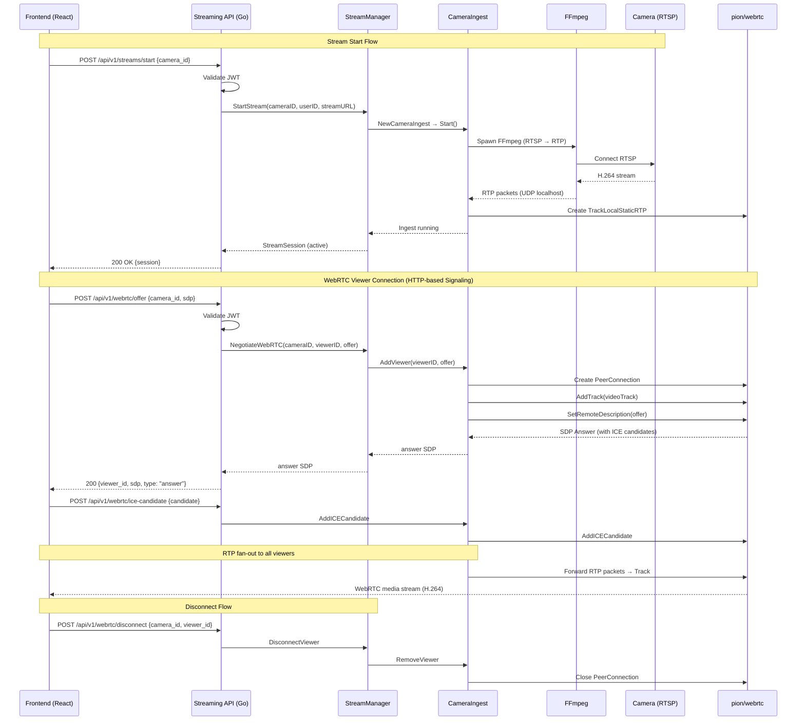

```mermaid
sequenceDiagram
    participant Client as Frontend (React)
    participant API as Streaming API (Go)
    participant SM as StreamManager
    participant CI as CameraIngest
    participant FF as FFmpeg
    participant Cam as Camera (RTSP)
    participant WR as pion/webrtc

    Note over Client, Cam: Stream Start Flow

    Client->>API: POST /api/v1/streams/start {camera_id}
    API->>API: Validate JWT
    API->>SM: StartStream(cameraID, userID, streamURL)
    SM->>CI: NewCameraIngest → Start()
    CI->>FF: Spawn FFmpeg (RTSP → RTP)
    FF->>Cam: Connect RTSP
    Cam-->>FF: H.264 stream
    FF-->>CI: RTP packets (UDP localhost)
    CI->>WR: Create TrackLocalStaticRTP
    CI-->>SM: Ingest running
    SM-->>API: StreamSession (active)
    API-->>Client: 200 OK {session}

    Note over Client, WR: WebRTC Viewer Connection (HTTP-based Signaling)

    Client->>API: POST /api/v1/webrtc/offer {camera_id, sdp}
    API->>API: Validate JWT
    API->>SM: NegotiateWebRTC(cameraID, viewerID, offer)
    SM->>CI: AddViewer(viewerID, offer)
    CI->>WR: Create PeerConnection
    CI->>WR: AddTrack(videoTrack)
    CI->>WR: SetRemoteDescription(offer)
    WR-->>CI: SDP Answer (with ICE candidates)
    CI-->>SM: answer SDP
    SM-->>API: answer SDP
    API-->>Client: 200 {viewer_id, sdp, type: "answer"}

    Client->>API: POST /api/v1/webrtc/ice-candidate {candidate}
    API->>CI: AddICECandidate
    CI->>WR: AddICECandidate

    Note over CI, Client: RTP fan-out to all viewers
    CI->>WR: Forward RTP packets → Track
    WR-->>Client: WebRTC media stream (H.264)

    Note over Client, SM: Disconnect Flow

    Client->>API: POST /api/v1/webrtc/disconnect {camera_id, viewer_id}
    API->>SM: DisconnectViewer
    SM->>CI: RemoveViewer
    CI->>WR: Close PeerConnection
```
