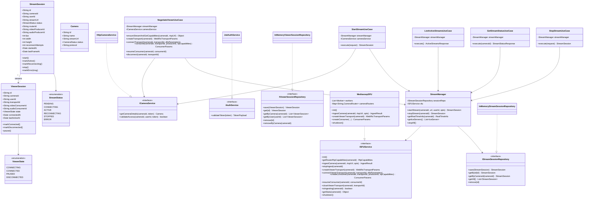

# Video Streaming Service — Class Diagram

```mermaid
classDiagram
    direction TB

    %% ─── Domain Entities ───
    class StreamSession {
        +String id
        +String cameraId
        +String userId
        +String streamUrl
        +StreamStatus status
        +String routerId
        +String videoProducerId
        +String audioProducerId
        +int fps
        +int width
        +int height
        +int reconnectAttempts
        +Date startedAt
        +Date lastFrameAt
        +start()
        +markActive()
        +markReconnecting()
        +stop()
        +markError(msg)
    }

    class StreamStatus {
        <<enumeration>>
        PENDING
        CONNECTING
        ACTIVE
        RECONNECTING
        STOPPED
        ERROR
    }

    class ViewerSession {
        +String id
        +String cameraId
        +String userId
        +String transportId
        +String videoConsumerId
        +String audioConsumerId
        +ViewerState state
        +Date connectedAt
        +Date lastActiveAt
        +markConnected()
        +markDisconnected()
        +pause()
    }

    class ViewerState {
        <<enumeration>>
        CONNECTING
        CONNECTED
        PAUSED
        DISCONNECTED
    }

    class Camera {
        +String id
        +String name
        +String streamUrl
        +CameraStatus status
        +String protocol
    }

    %% ─── Service Interfaces (Ports) ───
    class ISFUService {
        <<interface>>
        +init()
        +getRouterRtpCapabilities(cameraId) RtpCapabilities
        +ingestCamera(cameraId, rtspUrl, opts) IngestResult
        +stopIngest(cameraId)
        +createViewerTransport(cameraId) WebRtcTransportParams
        +connectViewerTransport(cameraId, transportId, dtlsParameters)
        +createConsumer(cameraId, transportId, producerId, rtpCapabilities) ConsumerParams
        +resumeConsumer(cameraId, consumerId)
        +closeViewerTransport(cameraId, transportId)
        +isIngesting(cameraId) boolean
        +getStats(cameraId) Object
        +shutdown()
    }

    class ICameraService {
        <<interface>>
        +getCameraDetails(cameraId, token) Camera
        +validateAccess(cameraId, userId, token) boolean
    }

    class IAuthService {
        <<interface>>
        +validateToken(token) TokenPayload
    }

    %% ─── Repository Interfaces ───
    class IStreamSessionRepository {
        <<interface>>
        +save(StreamSession) StreamSession
        +getById(id) StreamSession
        +getByCameraId(cameraId) StreamSession
        +getAll() List~StreamSession~
        +remove(id)
    }

    class IViewerSessionRepository {
        <<interface>>
        +save(ViewerSession) ViewerSession
        +get(id) ViewerSession
        +getByCamera(cameraId) List~ViewerSession~
        +getByUser(userId) List~ViewerSession~
        +remove(id)
        +removeByCamera(cameraId)
    }

    %% ─── Use Cases ───
    class StartStreamUseCase {
        -StreamManager streamManager
        -ICameraService cameraService
        +execute(request) StreamSession
    }

    class StopStreamUseCase {
        -StreamManager streamManager
        +execute(request) StreamSession
    }

    class GetStreamStatusUseCase {
        -StreamManager streamManager
        +execute(cameraId) StreamStatusResponse
    }

    class ListActiveStreamsUseCase {
        -StreamManager streamManager
        +execute() ActiveStreamsResponse
    }

    class NegotiateViewerUseCase {
        -StreamManager streamManager
        -ICameraService cameraService
        +ensureStreamAndGetCapabilities(cameraId, rtspUrl) Object
        +createTransport(cameraId) WebRtcTransportParams
        +connectTransport(cameraId, transportId, dtlsParameters)
        +consume(cameraId, transportId, producerId, rtpCapabilities) ConsumerParams
        +resumeConsumer(cameraId, consumerId)
        +disconnect(cameraId, transportId)
    }

    %% ─── Infrastructure ───
    class MediasoupSFU {
        -List~Worker~ workers
        -Map~String,CameraRouter~ cameraRouters
        +init()
        +ingestCamera(cameraId, rtspUrl, opts) IngestResult
        +createViewerTransport(cameraId) WebRtcTransportParams
        +createConsumer(...) ConsumerParams
        +shutdown()
    }

    class StreamManager {
        -IStreamSessionRepository sessionRepo
        -ISFUService sfu
        +startStream(cameraId, url, userId, opts) StreamSession
        +stopStream(cameraId) StreamSession
        +getRealTimeInfo(cameraId) RealTimeInfo
        +getIceServers() List~IceServer~
        +stopAll()
    }

    class InMemoryStreamSessionRepository
    class InMemoryViewerSessionRepository
    class JwtAuthService
    class HttpCameraService

    %% ─── Relationships ───
    StreamSession --> StreamStatus
    ViewerSession --> ViewerState
    StreamSession "1" --> "*" ViewerSession : viewers

    MediasoupSFU ..|> ISFUService
    InMemoryStreamSessionRepository ..|> IStreamSessionRepository
    InMemoryViewerSessionRepository ..|> IViewerSessionRepository
    JwtAuthService ..|> IAuthService
    HttpCameraService ..|> ICameraService

    StreamManager --> IStreamSessionRepository
    StreamManager --> ISFUService
    StartStreamUseCase --> StreamManager
    StartStreamUseCase --> ICameraService
    StopStreamUseCase --> StreamManager
    GetStreamStatusUseCase --> StreamManager
    ListActiveStreamsUseCase --> StreamManager
    NegotiateViewerUseCase --> StreamManager
    NegotiateViewerUseCase --> ICameraService
```
