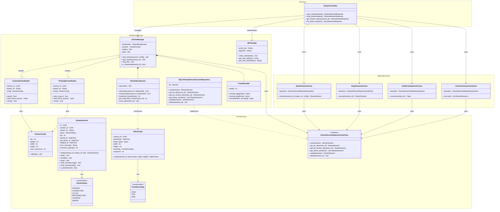

# Class Diagram — Video Streaming Microservice (Clean Architecture)

```mermaid
classDiagram
    direction TB

    namespace DomainLayer {
        class StreamStatus {
            <<enumeration>>
            PENDING
            CONNECTING
            ACTIVE
            RECONNECTING
            STOPPED
            ERROR
        }

        class FrameEncoding {
            <<enumeration>>
            JPEG
            PNG
            RAW
        }

        class StreamConfig {
            - fps : int
            - quality : int
            - width : int
            - height : int
            - max_reconnects : int
            + validate() void
        }

        class StreamSession {
            - id : UUID
            - camera_id : UUID
            - stream_url : String
            - status : StreamStatus
            - fps : int
            - started_at : DateTime
            - last_frame_at : DateTime
            - stopped_at : DateTime
            - error_message : String
            - reconnect_attempts : int
            + create(camera_id, stream_url, fps) StreamSession
            + start() void
            + activate() void
            + stop() void
            + mark_error(message) void
            + mark_reconnecting() void
            + is_alive(timeout) bool
        }

        class VideoFrame {
            - camera_id : UUID
            - timestamp : DateTime
            - frame_bytes : bytes
            - width : int
            - height : int
            - encoding : FrameEncoding
            - sequence : int
            + create(camera_id, frame_bytes, width, height) VideoFrame
        }

        class StreamSessionRepositoryInterface {
            <<interface>>
            + save(session) StreamSession
            + get_by_id(session_id) StreamSession
            + get_by_camera_id(camera_id) StreamSession
            + get_active_sessions() List~StreamSession~
            + update(session) StreamSession
            + delete(session_id) void
        }
    }

    namespace ApplicationLayer {
        class StartStreamUseCase {
            - repository : StreamSessionRepositoryInterface
            + execute(camera_id, stream_url, config) StreamSession
        }

        class StopStreamUseCase {
            - repository : StreamSessionRepositoryInterface
            + execute(camera_id) StreamSession
        }

        class GetStreamStatusUseCase {
            - repository : StreamSessionRepositoryInterface
            + execute(camera_id) Tuple
        }

        class ListActiveStreamsUseCase {
            - repository : StreamSessionRepositoryInterface
            + execute() List~StreamSession~
        }
    }

    namespace InfrastructureLayer {
        class SQLAlchemyStreamSessionRepository {
            - db : Session
            + save(session) StreamSession
            + get_by_id(session_id) StreamSession
            + get_by_camera_id(camera_id) StreamSession
            + get_active_sessions() List~StreamSession~
            + update(session) StreamSession
            + delete(session_id) void
        }

        class StreamManager {
            - broadcaster : StreamBroadcaster
            - encoder : FrameEncoder
            - readers : Dict
            - tasks : Dict
            + start_stream(session, config) void
            + stop_stream(camera_id) void
            + stop_all() void
            + is_streaming(camera_id) bool
        }

        class StreamBroadcaster {
            - subscribers : Dict
            + subscribe(camera_id, websocket) void
            + unsubscribe(camera_id, websocket) void
            + broadcast_frame(frame) int
            + get_subscriber_count(camera_id) int
            + close_all(camera_id) void
        }

        class CameraStreamReader {
            - camera_id : UUID
            - stream_url : String
            - config : StreamConfig
            + open() bool
            + read_frame_async() Tuple
            + close() void
        }

        class FFmpegStreamReader {
            - camera_id : UUID
            - stream_url : String
            - config : StreamConfig
            + open_async() bool
            + read_frame_async() Tuple
            + close() void
        }

        class FrameEncoder {
            - quality : int
            + encode_jpeg(frame) bytes
            + encode_png(frame) bytes
            + encode(frame, encoding) bytes
        }

        class JWTHandler {
            - secret_key : String
            - algorithm : String
            + verify_token(token) Dict
            + get_user_id(token) UUID
            + get_user_email(token) String
        }
    }

    namespace APILayer {
        class StreamController {
            + start_stream(request) StreamSessionResponse
            + stop_stream(request) StreamSessionResponse
            + get_stream_status(camera_id) StreamStatusResponse
            + list_active_streams() ActiveStreamsResponse
        }
    }

    %% ── Domain internal relationships ──
    StreamSession --> StreamStatus : has
    VideoFrame --> FrameEncoding : has

    %% ── Infrastructure implements Domain ──
    SQLAlchemyStreamSessionRepository ..|> StreamSessionRepositoryInterface : implements

    %% ── Infrastructure compositions & aggregations ──
    StreamManager *-- StreamBroadcaster
    StreamManager *-- FrameEncoder
    StreamManager o-- "0..*" CameraStreamReader : creates
    StreamManager o-- "0..*" FFmpegStreamReader : creates

    %% ── Infrastructure → Domain dependencies ──
    StreamManager --> StreamSessionRepositoryInterface : uses
    StreamBroadcaster ..> VideoFrame : broadcasts
    CameraStreamReader --> StreamConfig : uses
    FFmpegStreamReader --> StreamConfig : uses

    %% ── Application → Domain dependencies ──
    StartStreamUseCase --> StreamSessionRepositoryInterface : uses
    StopStreamUseCase --> StreamSessionRepositoryInterface : uses
    GetStreamStatusUseCase --> StreamSessionRepositoryInterface : uses
    ListActiveStreamsUseCase --> StreamSessionRepositoryInterface : uses

    %% ── API → Application & Infrastructure ──
    StreamController --> StartStreamUseCase : uses
    StreamController --> StopStreamUseCase : uses
    StreamController --> GetStreamStatusUseCase : uses
    StreamController --> ListActiveStreamsUseCase : uses
    StreamController --> JWTHandler : authenticates
    StreamController --> StreamManager : manages
```
