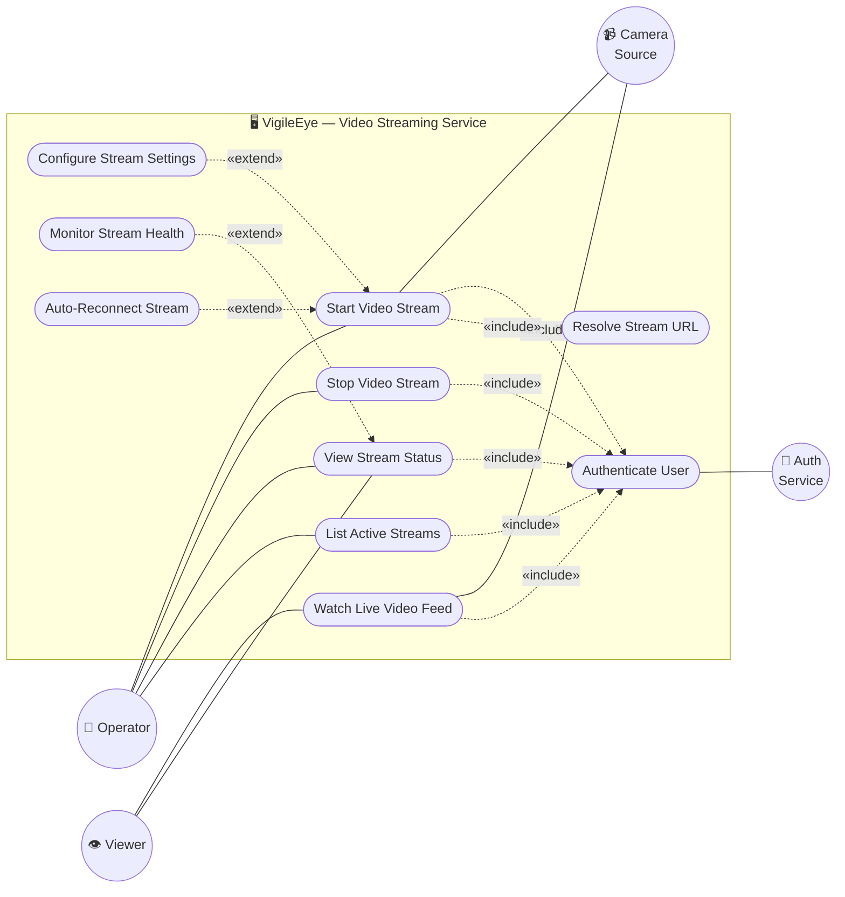

# Use Case Diagram — Video Streaming Microservice

```mermaid
flowchart LR

    %% ══════════ Primary Actors (left) ══════════
    Operator(("👤 Operator"))
    Viewer(("👁 Viewer"))

    %% ══════════ System Boundary ══════════
    subgraph sys ["🖥️ VigileEye — Video Streaming Service"]
        direction TB

        UC1(["Start Video Stream"])
        UC2(["Stop Video Stream"])
        UC3(["View Stream Status"])
        UC4(["List Active Streams"])
        UC5(["Watch Live Video Feed"])
        UC6(["Authenticate User"])
        UC7(["Configure Stream Settings"])
        UC8(["Monitor Stream Health"])
        UC9(["Resolve Stream URL"])
        UC10(["Auto-Reconnect Stream"])
    end

    %% ══════════ Secondary Actors (right) ══════════
    AuthService(("🔐 Auth\nService"))
    CameraSource(("📹 Camera\nSource"))

    %% ══════════ Actor ↔ Use Case Associations ══════════
    Operator --- UC1
    Operator --- UC2
    Operator --- UC3
    Operator --- UC4

    Viewer --- UC5
    Viewer --- UC3

    %% ══════════ External Actor Associations ══════════
    UC6 --- AuthService
    UC1 --- CameraSource
    UC5 --- CameraSource

    %% ══════════ «include» relationships ══════════
    UC1 -.->|"«include»"| UC6
    UC2 -.->|"«include»"| UC6
    UC3 -.->|"«include»"| UC6
    UC4 -.->|"«include»"| UC6
    UC5 -.->|"«include»"| UC6
    UC1 -.->|"«include»"| UC9

    %% ══════════ «extend» relationships ══════════
    UC7 -.->|"«extend»"| UC1
    UC8 -.->|"«extend»"| UC3
    UC10 -.->|"«extend»"| UC1
```
