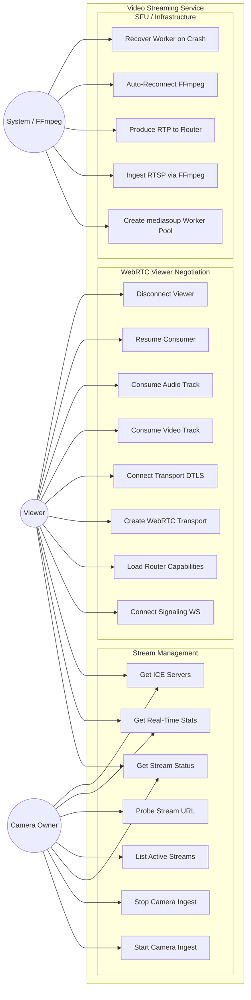

# Video Streaming Service — Use Case Diagram

```mermaid
graph LR
    %% Actors
    Owner((Camera Owner))
    Viewer((Viewer))
    System((System / FFmpeg))

    %% Use Cases
    subgraph Video Streaming Service
        direction TB
        subgraph Stream Management
            UC1[Start Camera Ingest]
            UC2[Stop Camera Ingest]
            UC3[Get Stream Status]
            UC4[List Active Streams]
            UC5[Probe Stream URL]
            UC6[Get Real-Time Stats]
            UC7[Get ICE Servers]
        end
        subgraph WebRTC Viewer Negotiation
            UC8[Connect Signaling WS]
            UC9[Load Router Capabilities]
            UC10[Create WebRTC Transport]
            UC11[Connect Transport DTLS]
            UC12[Consume Video Track]
            UC13[Consume Audio Track]
            UC14[Resume Consumer]
            UC15[Disconnect Viewer]
        end
        subgraph SFU / Infrastructure
            UC16[Create mediasoup Worker Pool]
            UC17[Ingest RTSP via FFmpeg]
            UC18[Produce RTP to Router]
            UC19[Auto-Reconnect FFmpeg]
            UC20[Recover Worker on Crash]
        end
    end

    %% Owner relationships
    Owner --> UC1
    Owner --> UC2
    Owner --> UC3
    Owner --> UC4
    Owner --> UC5
    Owner --> UC6
    Owner --> UC7

    %% Viewer relationships
    Viewer --> UC3
    Viewer --> UC6
    Viewer --> UC7
    Viewer --> UC8
    Viewer --> UC9
    Viewer --> UC10
    Viewer --> UC11
    Viewer --> UC12
    Viewer --> UC13
    Viewer --> UC14
    Viewer --> UC15

    %% System relationships
    System --> UC16
    System --> UC17
    System --> UC18
    System --> UC19
    System --> UC20
```
