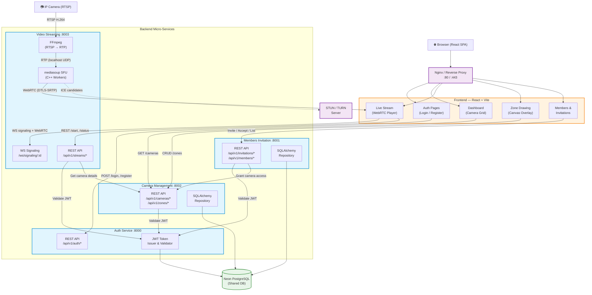

# System Overview — Architecture Diagram

> Shows how all five micro-services interact: Authentication, Camera Management, Video Streaming (WebRTC), Members & Invitations, and the Frontend SPA.

```mermaid
graph TB
    %% ─── Actors ───
    Browser["🌐 Browser (React SPA)"]
    IPCam["📷 IP Camera (RTSP)"]

    %% ─── Frontend ───
    subgraph Frontend ["Frontend — React + Vite"]
        direction TB
        FE_Auth["Auth Pages<br/>(Login / Register)"]
        FE_Dash["Dashboard<br/>(Camera Grid)"]
        FE_Stream["Live Stream<br/>(WebRTC Player)"]
        FE_Zones["Zone Drawing<br/>(Canvas Overlay)"]
        FE_Members["Members &<br/>Invitations"]
    end

    %% ─── API Gateway / Reverse Proxy ───
    Nginx["Nginx / Reverse Proxy<br/>:80 / :443"]

    %% ─── Backend Services ───
    subgraph Services ["Backend Micro-Services"]
        direction TB

        subgraph Auth ["Auth Service :8000"]
            AUTH_API["REST API<br/>/api/v1/auth/*"]
            AUTH_JWT["JWT Token<br/>Issuer & Validator"]
        end

        subgraph CamMgmt ["Camera Management :8002"]
            CAM_API["REST API<br/>/api/v1/cameras/*<br/>/api/v1/zones/*"]
            CAM_DB_ACCESS["SQLAlchemy<br/>Repository"]
        end

        subgraph Streaming ["Video Streaming :8003"]
            STREAM_REST["REST API<br/>/api/v1/streams/*"]
            STREAM_WS["WS Signaling<br/>/ws/signaling/:id"]
            SFU["mediasoup SFU<br/>(C++ Workers)"]
            FFMPEG["FFmpeg<br/>(RTSP → RTP)"]
        end

        subgraph Members ["Members Invitation :8001"]
            MEM_API["REST API<br/>/api/v1/invitations/*<br/>/api/v1/members/*"]
            MEM_DB_ACCESS["SQLAlchemy<br/>Repository"]
        end
    end

    %% ─── Databases ───
    NeonDB[("Neon PostgreSQL<br/>(Shared DB)")]
    STUN["STUN / TURN<br/>Server"]

    %% ─── Browser → Frontend ───
    Browser --> Nginx

    %% ─── Nginx → Services ───
    Nginx --> FE_Auth
    Nginx --> FE_Dash
    Nginx --> FE_Stream
    Nginx --> FE_Zones
    Nginx --> FE_Members

    %% ─── Frontend → Services ───
    FE_Auth -- "POST /login, /register" --> AUTH_API
    FE_Dash -- "GET /cameras" --> CAM_API
    FE_Stream -- "WS signaling + WebRTC" --> STREAM_WS
    FE_Stream -- "REST /start, /status" --> STREAM_REST
    FE_Zones -- "CRUD /zones" --> CAM_API
    FE_Members -- "Invite / Accept / List" --> MEM_API

    %% ─── Service-to-Service ───
    STREAM_REST -- "Validate JWT" --> AUTH_JWT
    STREAM_REST -- "Get camera details" --> CAM_API
    CAM_API -- "Validate JWT" --> AUTH_JWT
    MEM_API -- "Validate JWT" --> AUTH_JWT
    MEM_API -- "Grant camera access" --> CAM_API

    %% ─── Streaming Pipeline ───
    IPCam -- "RTSP H.264" --> FFMPEG
    FFMPEG -- "RTP (localhost UDP)" --> SFU
    SFU -- "WebRTC (DTLS-SRTP)" --> FE_Stream
    SFU -. "ICE candidates" .-> STUN

    %% ─── Database ───
    AUTH_JWT --> NeonDB
    CAM_DB_ACCESS --> NeonDB
    MEM_DB_ACCESS --> NeonDB

    %% ─── Styling ───
    classDef service fill:#e1f5fe,stroke:#0288d1,stroke-width:2px
    classDef frontend fill:#fff3e0,stroke:#f57c00,stroke-width:2px
    classDef db fill:#e8f5e9,stroke:#388e3c,stroke-width:2px
    classDef infra fill:#f3e5f5,stroke:#7b1fa2,stroke-width:2px

    class Auth,CamMgmt,Streaming,Members service
    class Frontend frontend
    class NeonDB db
    class STUN,Nginx infra
```
