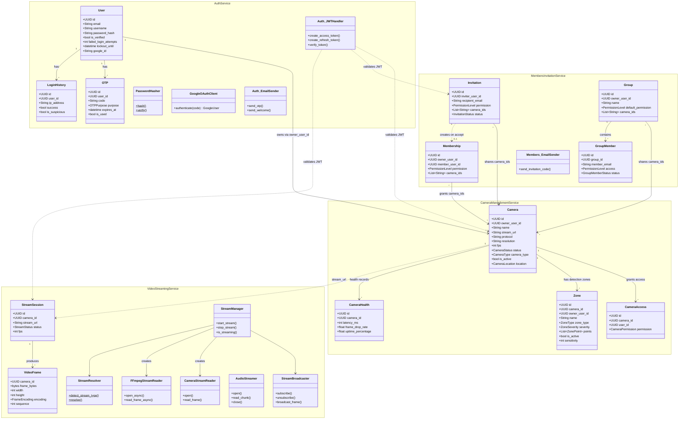

# VigileEye — System Overview Class Diagram

```mermaid
classDiagram
    direction TB

    %% ═══════════════════════════════════════════
    %% AUTH SERVICE (Port 8000)
    %% ═══════════════════════════════════════════
    namespace AuthService {
        class User {
            +UUID id
            +String email
            +String username
            +String password_hash
            +bool is_verified
            +int failed_login_attempts
            +datetime lockout_until
            +String google_id
        }
        class OTP {
            +UUID id
            +UUID user_id
            +String code
            +OTPPurpose purpose
            +datetime expires_at
            +bool is_used
        }
        class LoginHistory {
            +UUID id
            +UUID user_id
            +String ip_address
            +bool success
            +bool is_suspicious
        }
        class Auth_JWTHandler {
            +create_access_token()
            +create_refresh_token()
            +verify_token()
        }
        class PasswordHasher {
            +hash()$
            +verify()$
        }
        class GoogleOAuthClient {
            +authenticate(code) GoogleUser
        }
        class Auth_EmailSender {
            +send_otp()
            +send_welcome()
        }
    }

    %% ═══════════════════════════════════════════
    %% CAMERA MANAGEMENT SERVICE (Port 8002)
    %% ═══════════════════════════════════════════
    namespace CameraManagementService {
        class Camera {
            +UUID id
            +UUID owner_user_id
            +String name
            +String stream_url
            +String protocol
            +String resolution
            +int fps
            +CameraStatus status
            +CameraType camera_type
            +bool is_active
            +CameraLocation location
        }
        class CameraAccess {
            +UUID id
            +UUID camera_id
            +UUID user_id
            +CameraPermission permission
        }
        class CameraHealth {
            +UUID id
            +UUID camera_id
            +int latency_ms
            +float frame_drop_rate
            +float uptime_percentage
        }
        class Zone {
            +UUID id
            +UUID camera_id
            +UUID owner_user_id
            +String name
            +ZoneType zone_type
            +ZoneSeverity severity
            +List~ZonePoint~ points
            +bool is_active
            +int sensitivity
        }
    }

    %% ═══════════════════════════════════════════
    %% MEMBERS INVITATION SERVICE (Port 8001)
    %% ═══════════════════════════════════════════
    namespace MembersInvitationService {
        class Invitation {
            +UUID id
            +UUID inviter_user_id
            +String recipient_email
            +PermissionLevel permission
            +List~String~ camera_ids
            +InvitationStatus status
        }
        class Membership {
            +UUID id
            +UUID owner_user_id
            +UUID member_user_id
            +PermissionLevel permission
            +List~String~ camera_ids
        }
        class Group {
            +UUID id
            +UUID owner_user_id
            +String name
            +PermissionLevel default_permission
            +List~String~ camera_ids
        }
        class GroupMember {
            +UUID id
            +UUID group_id
            +String member_email
            +PermissionLevel access
            +GroupMemberStatus status
        }
        class Members_EmailSender {
            +send_invitation_code()
        }
    }

    %% ═══════════════════════════════════════════
    %% VIDEO STREAMING SERVICE (Port 8003)
    %% ═══════════════════════════════════════════
    namespace VideoStreamingService {
        class StreamSession {
            +UUID id
            +UUID camera_id
            +String stream_url
            +StreamStatus status
            +int fps
        }
        class VideoFrame {
            +UUID camera_id
            +bytes frame_bytes
            +int width
            +int height
            +FrameEncoding encoding
            +int sequence
        }
        class StreamManager {
            +start_stream()
            +stop_stream()
            +is_streaming()
        }
        class StreamBroadcaster {
            +subscribe()
            +unsubscribe()
            +broadcast_frame()
        }
        class CameraStreamReader {
            +open()
            +read_frame()
        }
        class FFmpegStreamReader {
            +open_async()
            +read_frame_async()
        }
        class AudioStreamer {
            +open()
            +read_chunk()
            +close()
        }
        class StreamResolver {
            +detect_stream_type()$
            +resolve()$
        }
    }

    %% ═══════════════════════════════════════════
    %% CROSS-SERVICE RELATIONSHIPS
    %% ═══════════════════════════════════════════

    %% Auth issues JWT tokens used by all services
    Auth_JWTHandler ..> Camera : validates JWT
    Auth_JWTHandler ..> Invitation : validates JWT
    Auth_JWTHandler ..> StreamSession : validates JWT

    %% User owns cameras
    User "1" --> "*" Camera : owns via owner_user_id

    %% Camera sharing via Members service
    Camera "1" --> "*" CameraAccess : grants access
    Invitation "*" --> "*" Camera : shares camera_ids
    Membership "*" --> "*" Camera : grants camera_ids
    Group "*" --> "*" Camera : shares camera_ids

    %% Invitation creates Membership
    Invitation "1" ..> "0..1" Membership : creates on accept

    %% Camera has zones
    Camera "1" --> "*" Zone : has detection zones
    Camera "1" --> "*" CameraHealth : health records

    %% Streaming uses camera URL
    Camera ..> StreamSession : stream_url
    StreamSession "1" --> "*" VideoFrame : produces
    StreamManager --> StreamBroadcaster
    StreamManager --> CameraStreamReader : creates
    StreamManager --> FFmpegStreamReader : creates
    StreamManager --> StreamResolver

    %% Group has members
    Group "1" --> "*" GroupMember : contains

    %% User entity connections
    User "1" --> "*" OTP : has
    User "1" --> "*" LoginHistory : has
```
