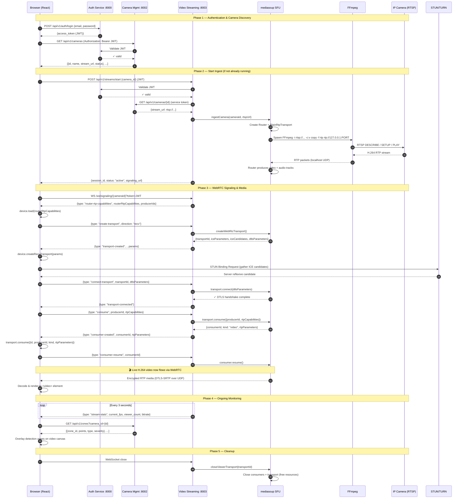

# System Overview — Sequence Diagram

> Shows the end-to-end flow when a user opens a live camera stream: authentication, camera lookup, WebRTC negotiation, and media delivery.

```mermaid
sequenceDiagram
    autonumber
    participant B as Browser (React)
    participant Auth as Auth Service :8000
    participant Cam as Camera Mgmt :8002
    participant VS as Video Streaming :8003
    participant SFU as mediasoup SFU
    participant FF as FFmpeg
    participant IP as IP Camera (RTSP)
    participant STUN as STUN/TURN

    Note over B,IP: Phase 1 — Authentication & Camera Discovery

    B->>Auth: POST /api/v1/auth/login {email, password}
    Auth-->>B: {access_token (JWT)}

    B->>Cam: GET /api/v1/cameras (Authorization: Bearer JWT)
    Cam->>Auth: Validate JWT
    Auth-->>Cam: ✓ valid
    Cam-->>B: [{id, name, stream_url, status}, ...]

    Note over B,IP: Phase 2 — Start Ingest (if not already running)

    B->>VS: POST /api/v1/streams/start {camera_id} (JWT)
    VS->>Auth: Validate JWT
    Auth-->>VS: ✓ valid
    VS->>Cam: GET /api/v1/cameras/{id} (service token)
    Cam-->>VS: {stream_url: rtsp://...}
    VS->>SFU: ingestCamera(cameraId, rtspUrl)
    SFU->>SFU: Create Router + PlainRtpTransport
    SFU->>FF: Spawn FFmpeg -i rtsp://... -c:v copy -f rtp rtp://127.0.0.1:PORT
    FF->>IP: RTSP DESCRIBE / SETUP / PLAY
    IP-->>FF: H.264 RTP stream
    FF-->>SFU: RTP packets (localhost UDP)
    SFU->>SFU: Router produces video + audio tracks
    VS-->>B: {session_id, status: "active", signaling_url}

    Note over B,IP: Phase 3 — WebRTC Signaling & Media

    B->>VS: WS /ws/signaling/{cameraId}?token=JWT
    VS-->>B: {type: "router-rtp-capabilities", routerRtpCapabilities, producerIds}
    B->>B: device.load(routerRtpCapabilities)

    B->>VS: {type: "create-transport", direction: "recv"}
    VS->>SFU: createWebRtcTransport()
    SFU-->>VS: {transportId, iceParameters, iceCandidates, dtlsParameters}
    VS-->>B: {type: "transport-created", ...params}

    B->>B: device.createRecvTransport(params)
    B->>STUN: STUN Binding Request (gather ICE candidates)
    STUN-->>B: Server reflexive candidate

    B->>VS: {type: "connect-transport", transportId, dtlsParameters}
    VS->>SFU: transport.connect(dtlsParameters)
    SFU-->>VS: ✓ DTLS handshake complete
    VS-->>B: {type: "transport-connected"}

    B->>VS: {type: "consume", producerId, rtpCapabilities}
    VS->>SFU: transport.consume({producerId, rtpCapabilities})
    SFU-->>VS: {consumerId, kind: "video", rtpParameters}
    VS-->>B: {type: "consumer-created", consumerId, rtpParameters}

    B->>B: transport.consume({id, producerId, kind, rtpParameters})
    B->>VS: {type: "consumer-resume", consumerId}
    VS->>SFU: consumer.resume()

    Note over B,SFU: 🎬 Live H.264 video now flows via WebRTC

    SFU-->>B: Encrypted RTP media (DTLS-SRTP over UDP)
    B->>B: Decode & render to <video> element

    Note over B,IP: Phase 4 — Ongoing Monitoring

    loop Every 3 seconds
        VS-->>B: {type: "stream-stats", current_fps, viewer_count, bitrate}
    end

    B->>Cam: GET /api/v1/zones?camera_id={id}
    Cam-->>B: [{zone_id, points, type, severity}, ...]
    B->>B: Overlay detection zones on video canvas

    Note over B,IP: Phase 5 — Cleanup

    B->>VS: WebSocket close
    VS->>SFU: closeViewerTransport(transportId)
    SFU->>SFU: Close consumers + transport (free resources)
```
