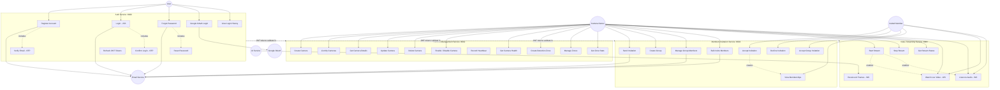

# VigileEye — System Overview Use Case Diagram

```mermaid
graph TB
    %% ─── Actors ───
    User((User))
    CameraOwner((Camera Owner))
    InvitedMember((Invited Member))
    Google((Google OAuth))
    EmailSvc((Email Service))
    AIService((AI Service))

    %% ─── Auth Service (Port 8000) ───
    subgraph AuthService["Auth Service :8000"]
        direction TB
        A1[Register Account]
        A2[Verify Email - OTP]
        A3[Login - 2FA]
        A4[Confirm Login - OTP]
        A5[Forgot Password]
        A6[Reset Password]
        A7[Refresh JWT Tokens]
        A8[Google OAuth Login]
        A9[View Login History]
    end

    %% ─── Camera Management Service (Port 8002) ───
    subgraph CameraService["Camera Management Service :8002"]
        direction TB
        C1[Create Camera]
        C2[List My Cameras]
        C3[Get Camera Details]
        C4[Update Camera]
        C5[Delete Camera]
        C6[Enable / Disable Camera]
        C7[Record Heartbeat]
        C8[Get Camera Health]
        C9[Create Detection Zone]
        C10[Manage Zones]
        C11[Get Zone Stats]
    end

    %% ─── Members Invitation Service (Port 8001) ───
    subgraph MembersService["Members Invitation Service :8001"]
        direction TB
        M1[Send Invitation]
        M2[Accept Invitation]
        M3[Decline Invitation]
        M4[Create Group]
        M5[Manage Group Members]
        M6[Accept Group Invitation]
        M7[View Memberships]
        M8[Bulk Invite Members]
    end

    %% ─── Video Streaming Service (Port 8003) ───
    subgraph StreamService["Video Streaming Service :8003"]
        direction TB
        S1[Start Stream]
        S2[Stop Stream]
        S3[Get Stream Status]
        S4[Watch Live Video - WS]
        S5[Listen to Audio - WS]
        S6[Receive AI Frames - WS]
    end

    %% ─── User → Auth ───
    User --> A1
    User --> A3
    User --> A5
    User --> A8
    User --> A9

    %% ─── Camera Owner flows ───
    CameraOwner --> C1
    CameraOwner --> C2
    CameraOwner --> C3
    CameraOwner --> C4
    CameraOwner --> C5
    CameraOwner --> C6
    CameraOwner --> C8
    CameraOwner --> C9
    CameraOwner --> C10
    CameraOwner --> C11
    CameraOwner --> M1
    CameraOwner --> M4
    CameraOwner --> M5
    CameraOwner --> M8
    CameraOwner --> S1
    CameraOwner --> S2
    CameraOwner --> S3
    CameraOwner --> S4
    CameraOwner --> S5

    %% ─── Invited Member flows ───
    InvitedMember --> M2
    InvitedMember --> M3
    InvitedMember --> M6
    InvitedMember --> M7
    InvitedMember --> S4
    InvitedMember --> S5

    %% ─── External Systems ───
    A8 --> Google
    A1 --> EmailSvc
    A3 --> EmailSvc
    A5 --> EmailSvc
    M1 --> EmailSvc
    M5 --> EmailSvc
    M8 --> EmailSvc

    %% ─── AI Service ───
    AIService --> S6

    %% ─── Cross-service dependencies ───
    A1 -.->|includes| A2
    A3 -.->|includes| A4
    A5 -.->|includes| A6
    M2 -.->|creates| M7
    S1 -.->|enables| S4
    S1 -.->|enables| S5

    %% ─── JWT shared across services ───
    AuthService -.->|JWT tokens validate in| CameraService
    AuthService -.->|JWT tokens validate in| MembersService
    AuthService -.->|JWT tokens validate in| StreamService
```
